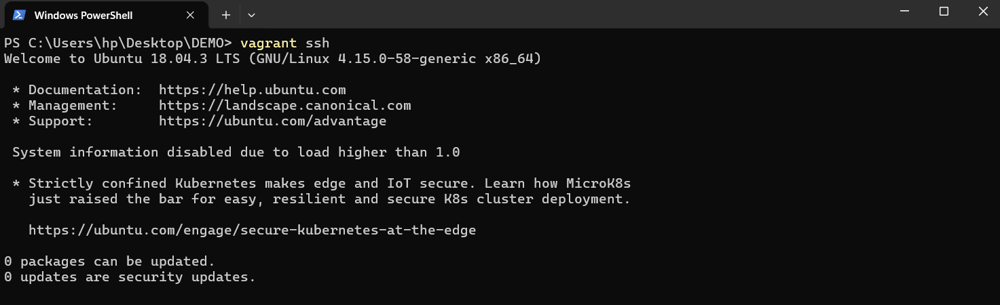
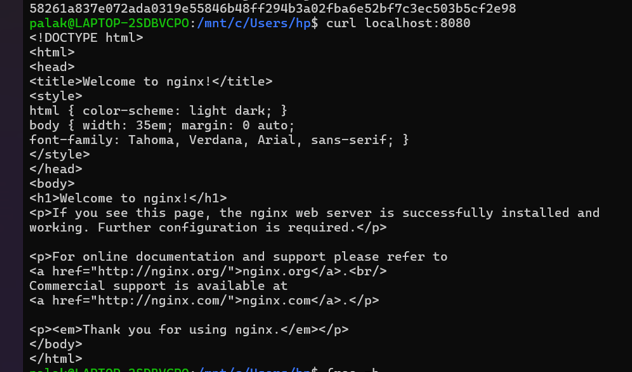
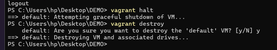

This is Experiment-1 Readme

Download Virtual Box from [here](https://www.virtualbox.org/wiki/Downloads)


Download Vagrant from [here](https://developer.hashicorp.com/vagrant/install)


To verify the installation we will check the version via following command
``` bash
vagrant --version
```


Initialize Vagrant with Ubuntu box:
```bash
vagrant init hashicorp/bionic64
```


Start the VM:
   ```bash
   vagrant up
   ```


Access the VM:
```bash
vagrant sshS
```



Step 4: Install Nginx inside VM
```bash
sudo apt update
sudo apt install -y nginx
sudo systemctl start nginx
```


Verify Nginx
```bash
curl localhost
``` 



Utilization Matrix In Running State



Stop VM
```bash
vagrant halt
```


Utilization Matrix In Stop State


Remove VM
```bash
vagrant destroy
```
