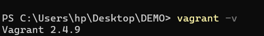
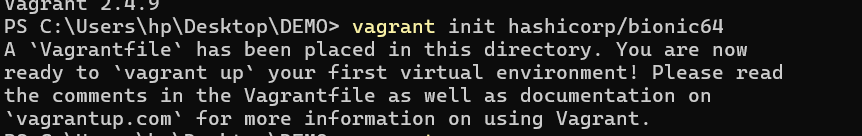
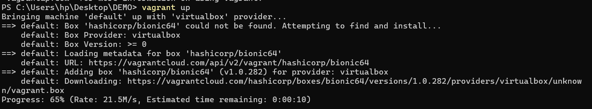
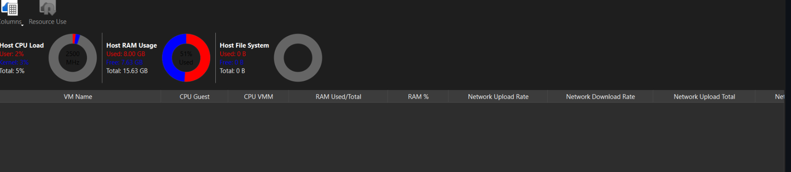
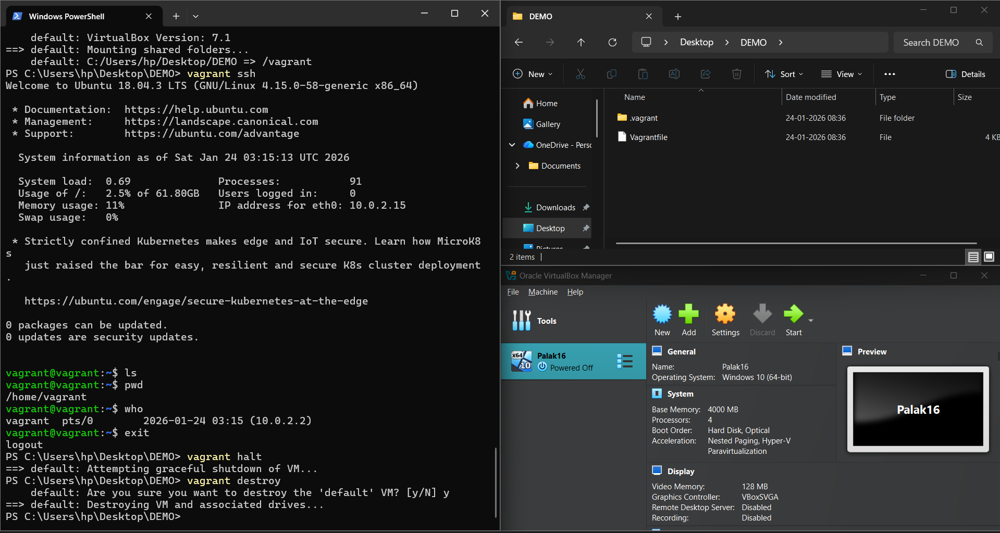
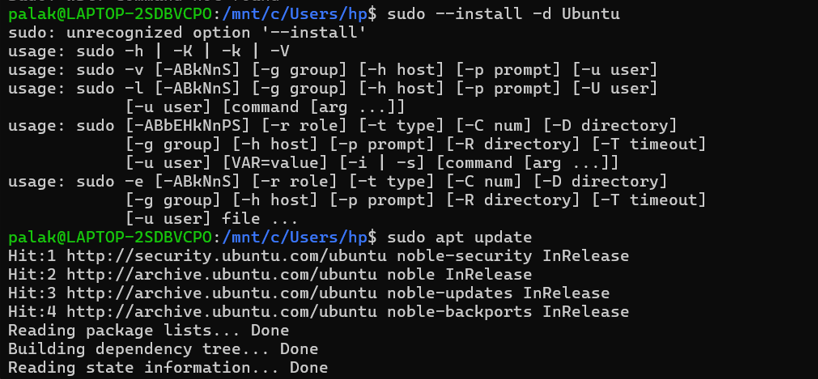
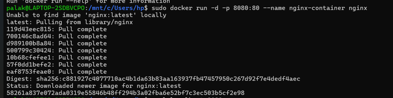

This is Experiment-1 Readme

Download Virtual Box from [here](https://www.virtualbox.org/wiki/Downloads)


Download Vagrant from [here](https://developer.hashicorp.com/vagrant/install)


To verify the installation we will check the version via following command
``` bash
vagrant --version
```



Initialize Vagrant with Ubuntu box:
```bash
vagrant init hashicorp/bionic64
```



Start the VM:
   ```bash
   vagrant up
   ```



Access the VM:
```bash
vagrant sshS
```


Step 4: Install Nginx inside VM
```bash
sudo apt update
sudo apt install -y nginx
sudo systemctl start nginx
```


Verify Nginx
```bash
curl localhost
``` 


Utilization Matrix In Running State


Stop VM
```bash
vagrant halt
```


Utilization Matrix In Stop State



Remove VM
```bash
vagrant destroy
```


#### PART-B:- Containers using WSL (Windows)
<hr>

**Step 1: Install WSL**
```powershell
wsl --install
```
Reboot the system after installation.


**Step 2: Install Ubuntu on WSL**

```powershell
wsl --install -d Ubuntu
```



**Step 3: Install Docker Engine inside WSL**

```bash
sudo apt update
sudo apt install -y docker.io
sudo systemctl start docker
sudo usermod -aG docker $USER
```
Logout and login again to apply group changes.

**Step 4: Verify Docker Installation**

```bash
docker --version
```


**Step 5: Pull Ubuntu Image**
```bash
docker pull ubuntu
```


**Step 6: Run Ubuntu Container with Nginx**
```bash
docker run -d -p 8080:80 --name nginx-container nginx
```



**Step 7: Verify Nginx in Container**
```bash
curl localhost:8080
```


**Step 8: Container Observation Commands**
```bash
docker stats
free -h
```


**Parameters to Compare**

| Parameter    | Virtual Machine | Container |
| ------------ | --------------- | --------- |
| Boot Time    | High            | Very Low  |
| RAM Usage    | High            | Low       |
| CPU Overhead | Higher          | Minimal   |
| Disk Usage   | Larger          | Smaller   |
| Isolation    | Strong          | Moderate  |
