# Experiment 6 A
## Title: Comparison of Docker Run and Docker Compose


# PART A – THEORY

## 1. Objective

To understand the relationship between `docker run` and Docker Compose, and to compare their configuration syntax and use cases.

---


Example:

```bash
docker run -d \
  --name my-nginx \
  -p 8080:80 \
  -v ./html:/usr/share/nginx/html \
  -e NGINX_HOST=localhost \
  --restart unless-stopped \
  nginx:alpine
```
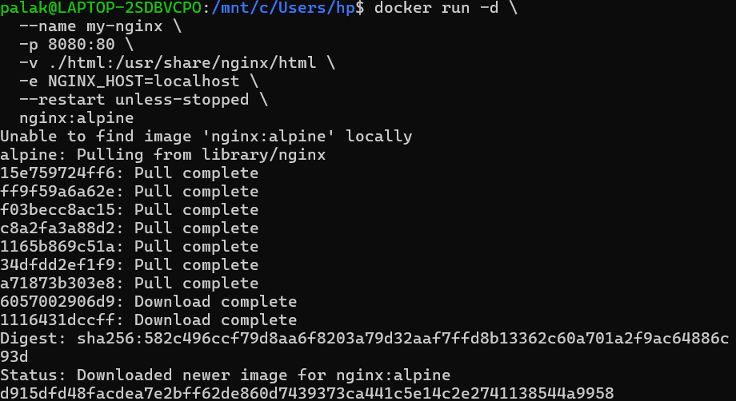
---

### 2.2 Docker Compose (Declarative Approach)

Docker Compose uses a YAML file (`docker-compose.yml`) to define services, networks, and volumes in a structured format.

```bash
docker compose up -d
```
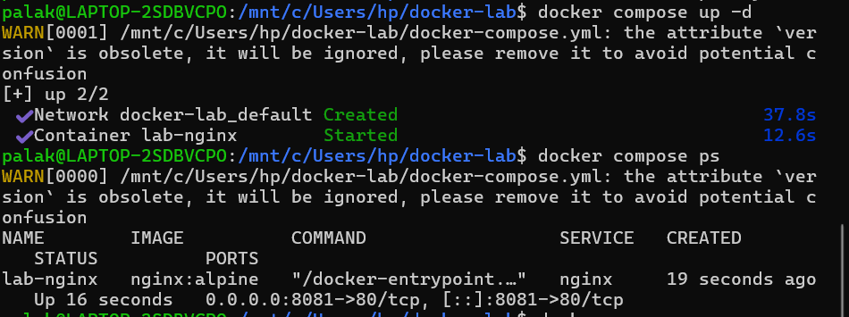

Compose is **declarative**, meaning you define the desired state of the application.

Equivalent Compose file:

```yaml
version: '3.8'

services:
  nginx:
    image: nginx:alpine
    container_name: my-nginx
    ports:
      - "8080:80"
    volumes:
      - ./html:/usr/share/nginx/html
    environment:
      NGINX_HOST: localhost
    restart: unless-stopped
```
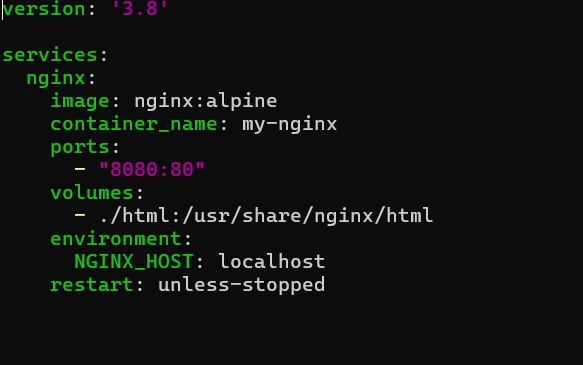

---

## 3. Mapping: Docker Run vs Docker Compose

---

## 4. Advantages of Docker Compose

1. Simplifies multi-container applications
2. Provides reproducibility
3. Version controllable configuration
4. Unified lifecycle management
5. Supports service scaling

Example:

```bash
docker compose up --scale web=3

```
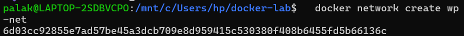

---

# PART B – PRACTICAL TASK

## Task 1: Single Container Comparison

### Step 1: Run Nginx Using Docker Run

Execute:

```bash
docker run -d \
  --name lab-nginx \
  -p 8081:80 \
  -v $(pwd)/html:/usr/share/nginx/html \
  nginx:alpine
```

Verify:

```bash
docker ps
```
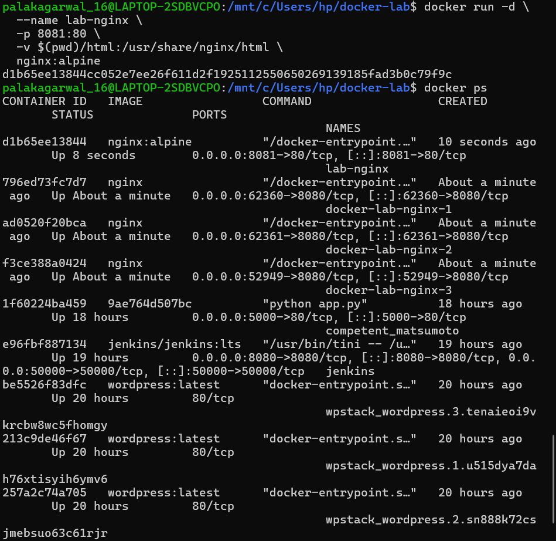

Access:

```
http://localhost:8081
```

Stop and remove container:

```bash
docker stop lab-nginx
docker rm lab-nginx
```
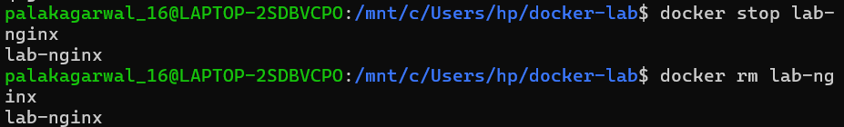

---

### Step 2: Run Same Setup Using Docker Compose

Create `docker-compose.yml`:

```yaml
version: '3.8'

services:
  nginx:
    image: nginx:alpine
    container_name: lab-nginx
    ports:
      - "8081:80"
    volumes:
      - ./html:/usr/share/nginx/html
```
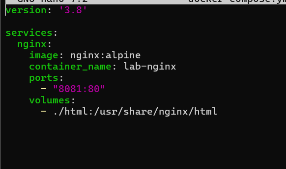
Run:

```bash
docker compose up -d
```
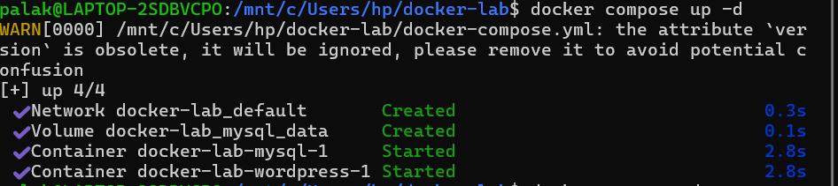

Verify:

```bash
docker compose ps
```
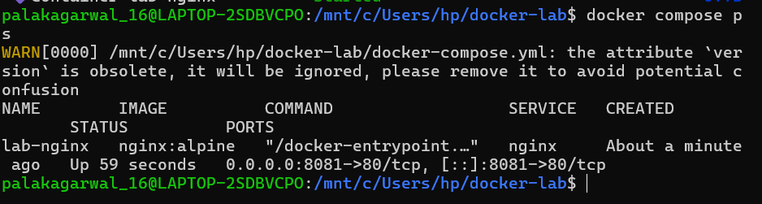
Stop:

```bash
docker compose down
```
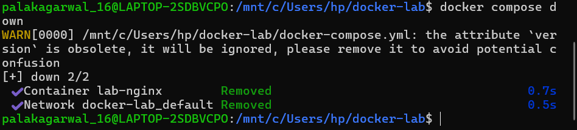
---

## Task 2: Multi-Container Application

### Objective:

Deploy WordPress with MySQL using:

1. Docker Run (manual way)
2. Docker Compose (structured way)

---

### A. Using Docker Run

1. Create network:

```bash
docker network create wp-net
```
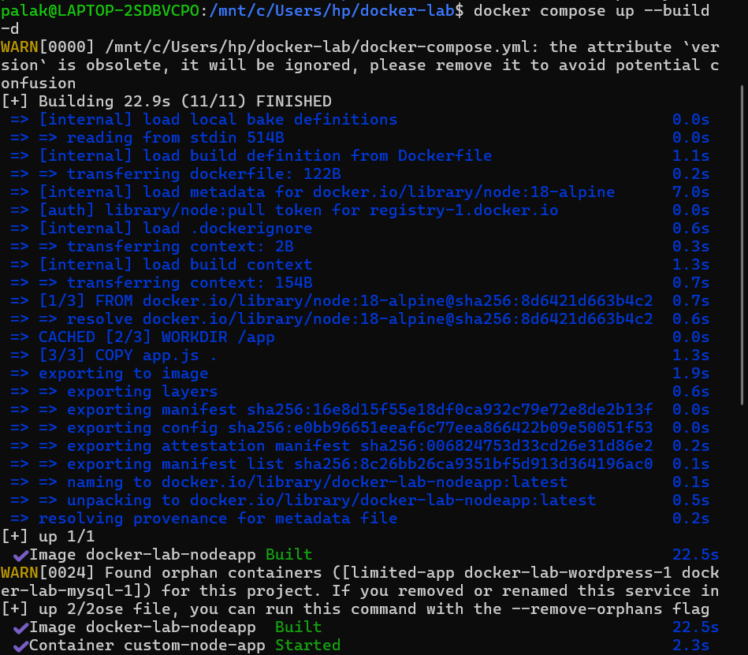
2. Run MySQL:

```bash
docker run -d \
  --name mysql \
  --network wp-net \
  -e MYSQL_ROOT_PASSWORD=secret \
  -e MYSQL_DATABASE=wordpress \
  mysql:5.7
```
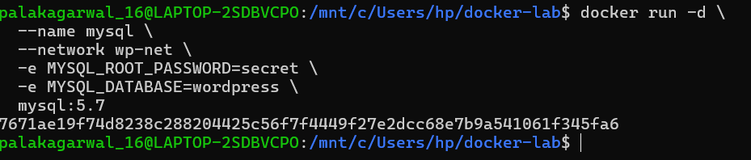

3. Run WordPress:

```bash
docker run -d \
  --name wordpress \
  --network wp-net \
  -p 8082:80 \
  -e WORDPRESS_DB_HOST=mysql \
  -e WORDPRESS_DB_PASSWORD=secret \
  wordpress:latest
```
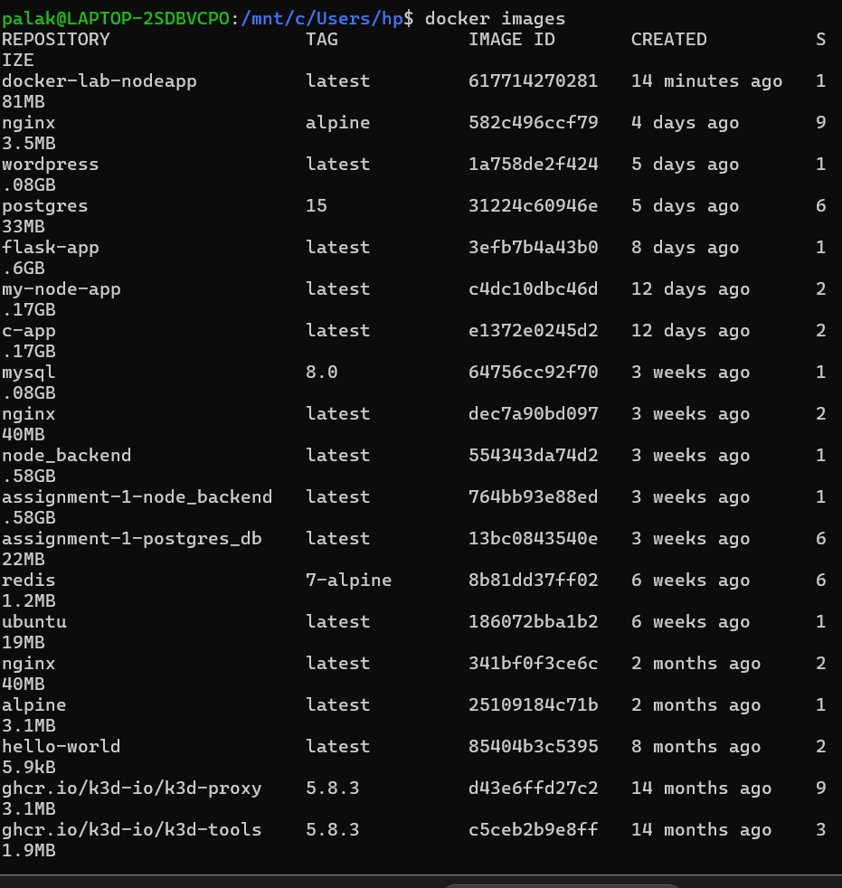

Test:

```
http://localhost:8082
```

---

### B. Using Docker Compose

Create `docker-compose.yml`:

```yaml
version: '3.8'

services:
  mysql:
    image: mysql:5.7
    environment:
      MYSQL_ROOT_PASSWORD: secret
      MYSQL_DATABASE: wordpress
    volumes:
      - mysql_data:/var/lib/mysql

  wordpress:
    image: wordpress:latest
    ports:
      - "8082:80"
    environment:
      WORDPRESS_DB_HOST: mysql
      WORDPRESS_DB_PASSWORD: secret
    depends_on:
      - mysql

volumes:
  mysql_data:
```
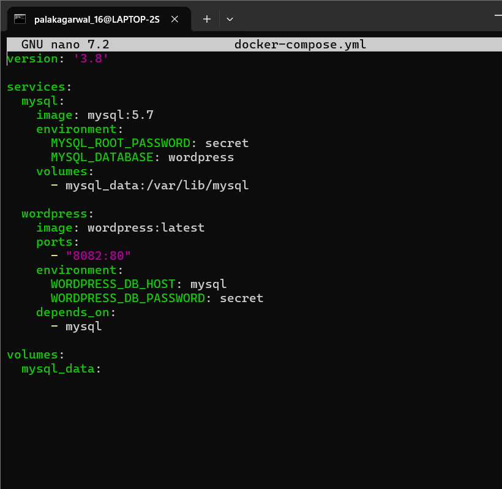
Run:

```bash
docker compose up -d
```

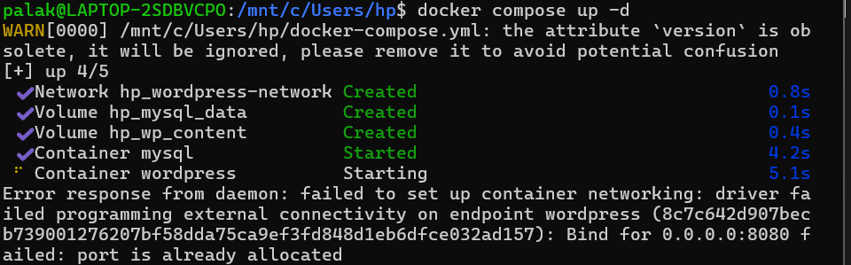
Stop:

```bash
docker compose down -v
```
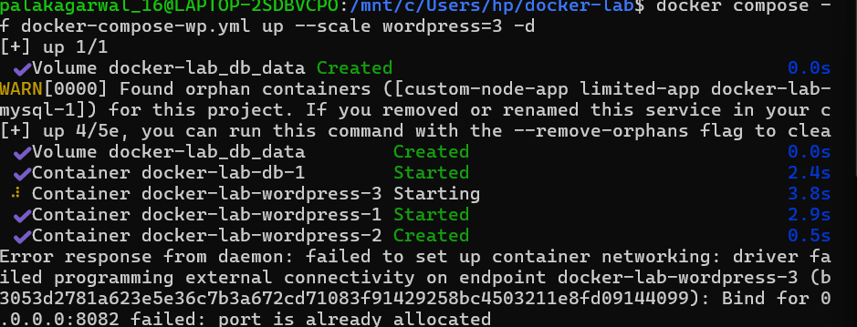
---


# PART C – CONVERSION & BUILD-BASED TASKS

## Task 3: Convert Docker Run to Docker Compose

### Problem 1: Basic Web Application

### Given Docker Run Command:

```bash
docker run -d \
  --name webapp \
  -p 5000:5000 \
  -e APP_ENV=production \
  -e DEBUG=false \
  --restart unless-stopped \
  node:18-alpine
```
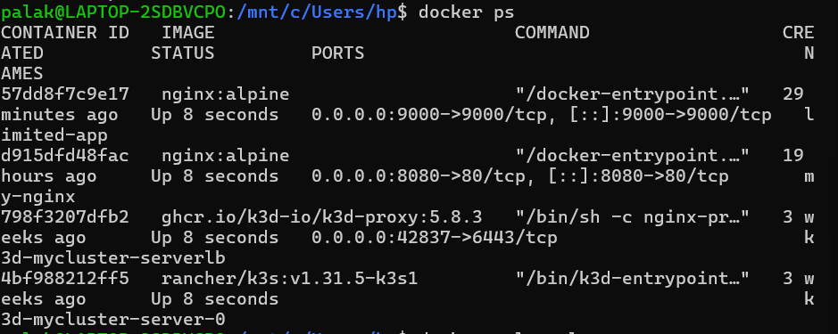

---

### Student Task:

1. Write an equivalent `docker-compose.yml`
2. Ensure:

   * Same container name
   * Same port mapping
   * Same environment variables
   * Same restart policy
3. Run using:

   ```bash
   docker compose up -d
   ```
4. Verify using:

   ```bash
   docker compose ps
   ```
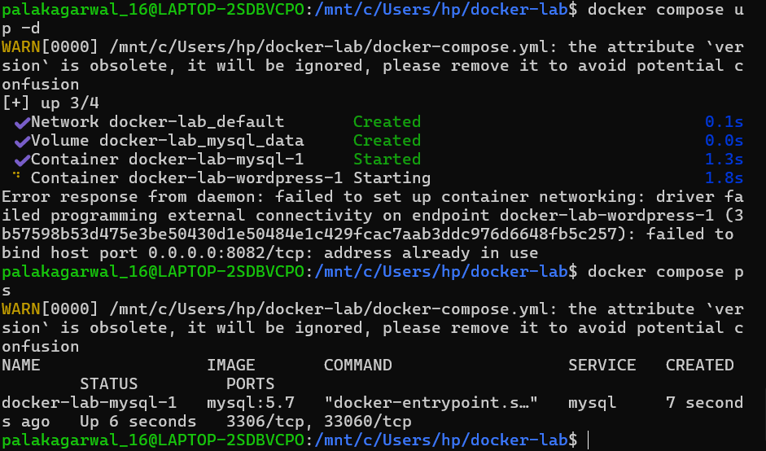
---

## Problem 2: Volume + Network Configuration

### Given Docker Run Commands:

```bash
docker network create app-net
```
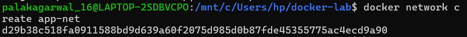

```bash
docker run -d \
  --name postgres-db \
  --network app-net \
  -e POSTGRES_USER=admin \
  -e POSTGRES_PASSWORD=secret \
  -v pgdata:/var/lib/postgresql/data \
  postgres:15
```
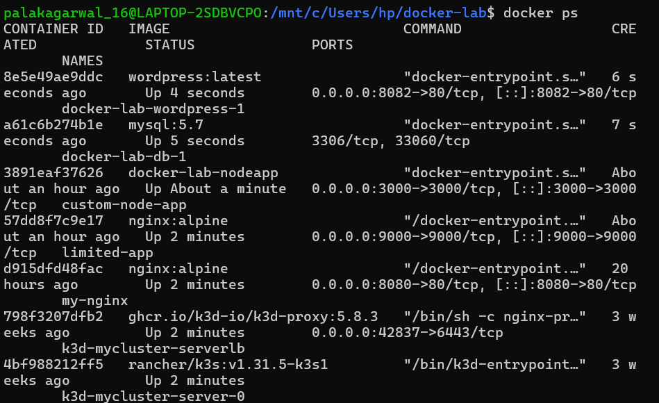

```bash
docker run -d \
  --name backend \
  --network app-net \
  -p 8000:8000 \
  -e DB_HOST=postgres-db \
  -e DB_USER=admin \
  -e DB_PASS=secret \
  python:3.11-slim
```
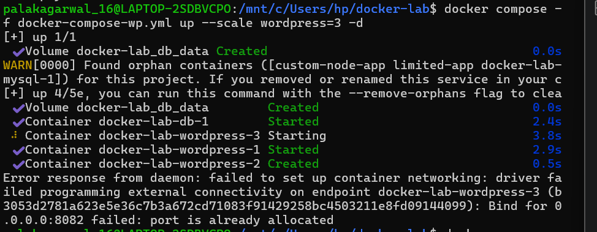


---

### Student Task:

1. Create a single `docker-compose.yml` file that:

   * Defines both services
   * Creates named volume `pgdata`
   * Creates custom network `app-net`
   * Uses `depends_on`
2. Bring up services using one command.
3. Stop and remove everything properly.
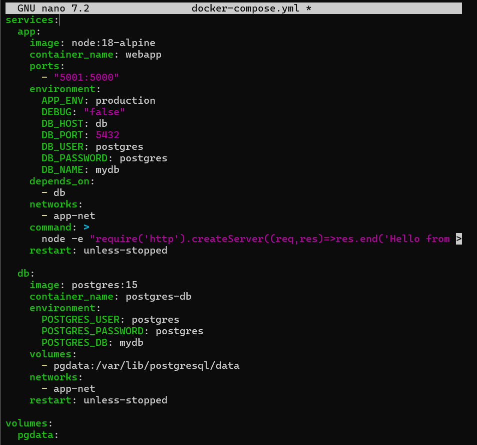
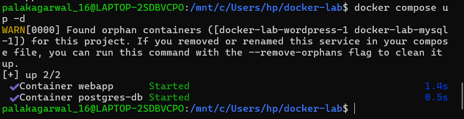
---

## Task 4: Resource Limits Conversion

### Given Docker Run Command:

```bash
docker run -d \
  --name limited-app \
  -p 9000:9000 \
  --memory="256m" \
  --cpus="0.5" \
  --restart always \
  nginx:alpine
```
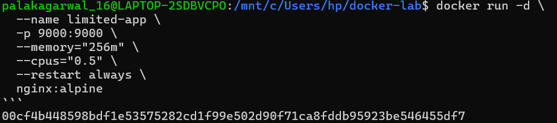
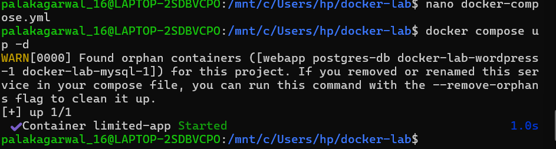
---

### Student Task:

1. Convert this to Docker Compose.
2. Add resource limits using:

   ```yaml
   deploy:
     resources:
       limits:
   ```
3. Explain:

   * When `deploy` works
   * Difference between normal Compose mode and Swarm mode

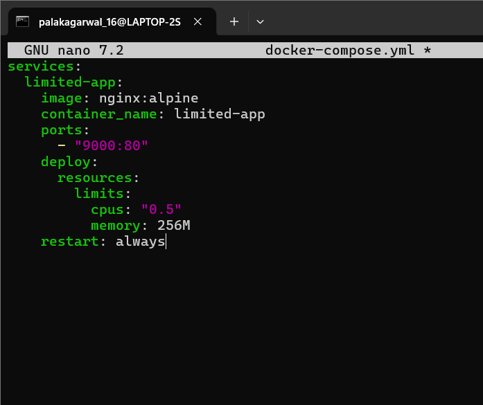
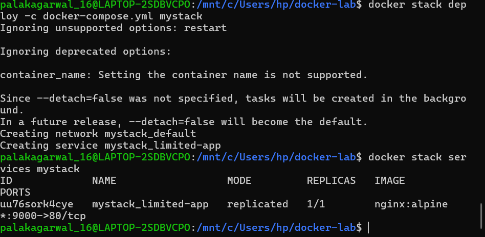
---

# PART D – USING DOCKERFILE INSTEAD OF STANDARD IMAGE

```yaml
image: node:18-alpine
```

Students must:

* Create their own Dockerfile
* Build image using Compose
* Run container from that build
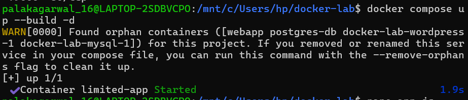


---

## Task 5: Replace Standard Image with Dockerfile (Node App)

### Scenario

You are given:

```bash
docker run -d -p 3000:3000 node:18-alpine

```
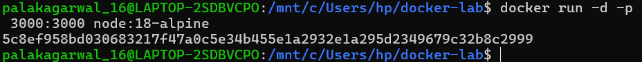

Now instead of directly using `node:18-alpine`, you must:

1. Create a simple Node.js app
2. Write a Dockerfile
3. Use Docker Compose `build:` option


---

### Step 1: Create `app.js`

```javascript
const http = require('http');

http.createServer((req, res) => {
  res.end("Docker Compose Build Lab");
}).listen(3000);
```
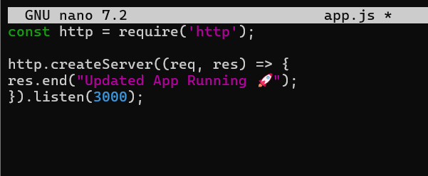
---

### Step 2: Create `Dockerfile`

```dockerfile
FROM node:18-alpine

WORKDIR /app

COPY app.js .

EXPOSE 3000

CMD ["node", "app.js"]
```
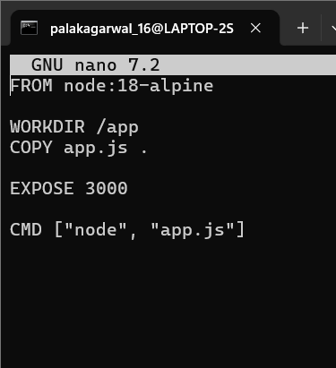
---

### Step 3: Create `docker-compose.yml`

```yaml
version: '3.8'

services:
  nodeapp:
    build:
      context: .
      dockerfile: Dockerfile
    container_name: custom-node-app
    ports:
      - "3000:3000"
```
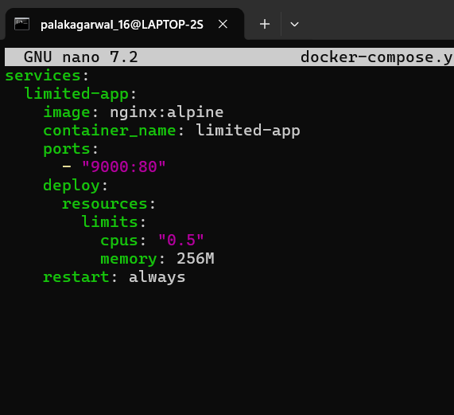
---

### Student Task:

1. Build and run using:

   ```bash
   docker compose up --build -d
   ```
   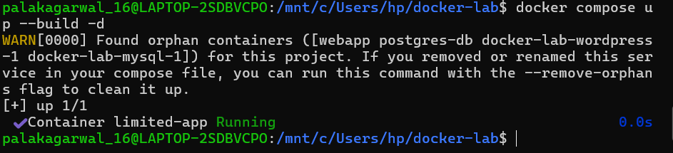
2. Verify in browser:

   ```
   http://localhost:3000
   ```
3. Modify `app.js` message.
4. Rebuild and observe changes.
5. Explain difference between:

   * `image:`
   * `build:`
   
   image:
image: node:18-alpine
 Meaning:
Uses pre-built image from Docker Hub
No Dockerfile needed
Faster startup
 Example use:
nginx
mysql

build:
  context: .
  dockerfile: Dockerfile
 Meaning:
Builds custom image from Dockerfile
You control app setup
Used for real applications

---

# Advanced Build Challenge

## Task 6: Multi-Stage Dockerfile with Compose

### Requirement:

Create a simple Python FastAPI or Node production-ready app using:

* Multi-stage Dockerfile
* Smaller final image
* Use Compose to build it
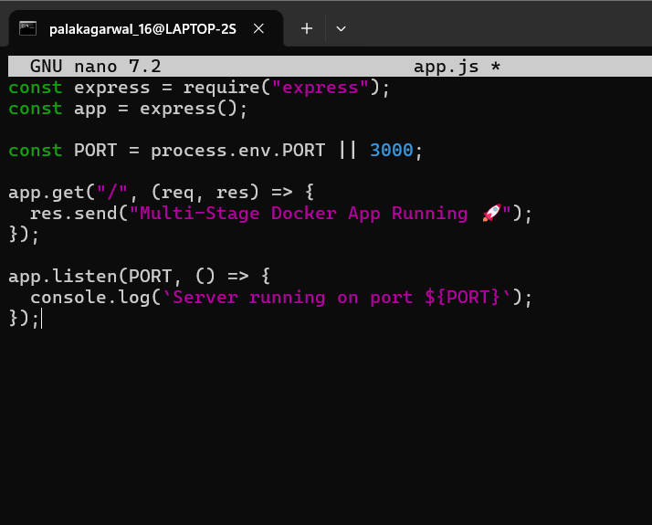
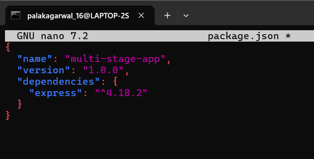
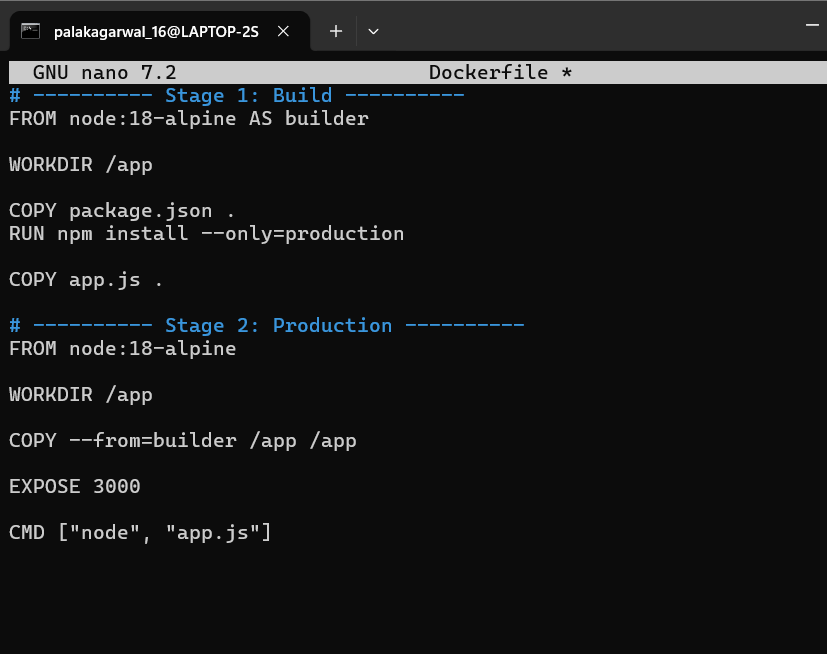
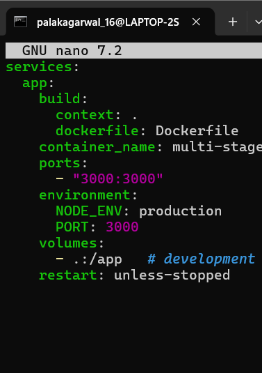
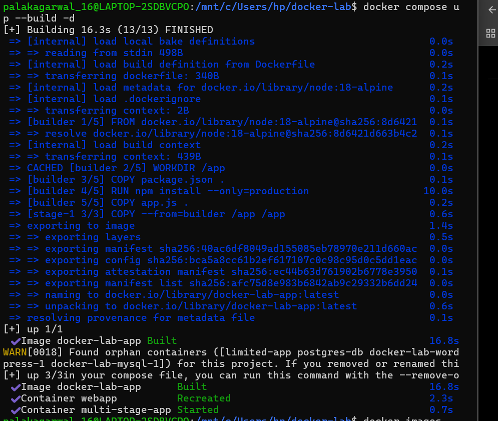
---

### Must:

1. Write multi-stage Dockerfile
2. Use `build:` in Compose
3. Add environment variables
4. Add volume mount for development mode
5. Compare image size:

   ```bash
   docker images
   ```
   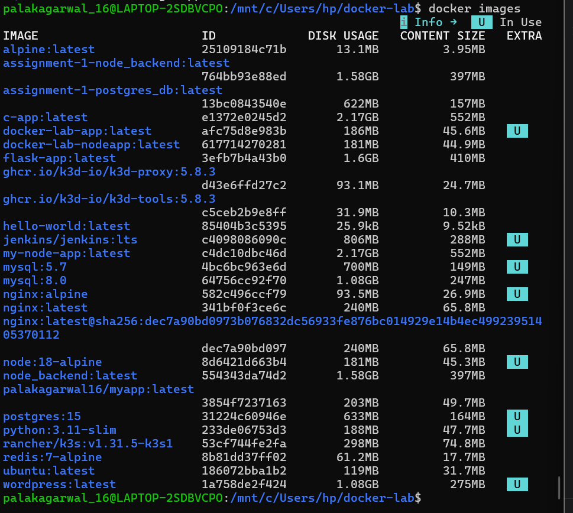


---

# Experiment 6 B 
## Multi-Container Application using Docker Compose (WordPress + Database)**

### **1. Objective**

To deploy a multi-container application using **Docker Compose**, consisting of:

* **WordPress (frontend + PHP)**
* **MySQL database (backend)**


### **3. Architecture Overview**

```
User (Browser)
      |
   WordPress Container
      |
   MySQL Container
      |
   Persistent Volume (Database Storage)
```

---
## Steps

### **Step 1: Create Project Directory**

```bash
mkdir wp-compose-lab
cd wp-compose-lab
```
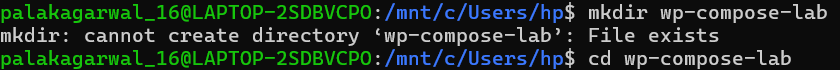
---

### **Step 2: Create docker-compose.yml**

```yaml
version: '3.9'

services:
  db:
    image: mysql:5.7
    container_name: wordpress_db
    restart: always
    environment:
      MYSQL_ROOT_PASSWORD: rootpass
      MYSQL_DATABASE: wordpress
      MYSQL_USER: wpuser
      MYSQL_PASSWORD: wppass
    volumes:
      - db_data:/var/lib/mysql

  wordpress:
    image: wordpress:latest
    container_name: wordpress_app
    depends_on:
      - db
    ports:
      - "8080:80"
    restart: always
    environment:
      WORDPRESS_DB_HOST: db:3306
      WORDPRESS_DB_USER: wpuser
      WORDPRESS_DB_PASSWORD: wppass
      WORDPRESS_DB_NAME: wordpress
    volumes:
      - wp_data:/var/www/html

volumes:
  db_data:
  wp_data:
```
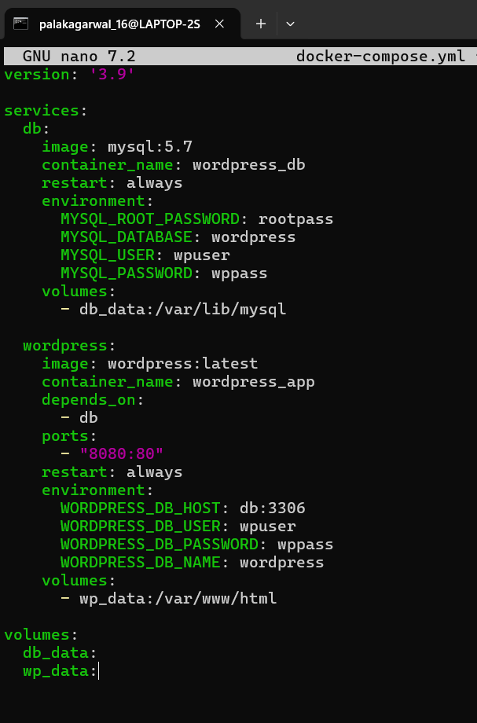
---


#### **depends_on**

* Ensures DB starts before WordPress

### **Step 3: Start Application**

```bash
docker-compose up -d
```
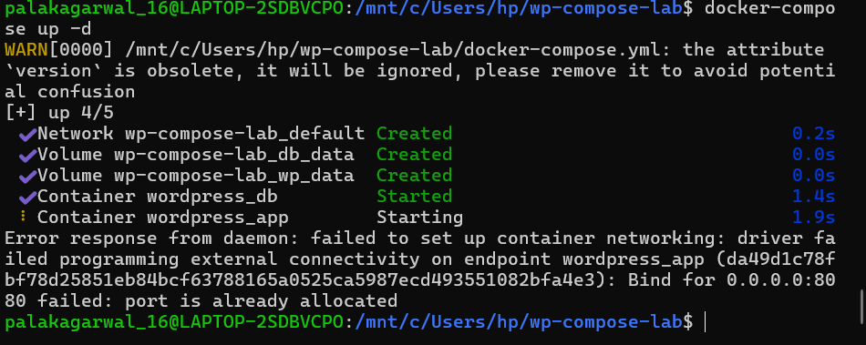
What happens:

* Images are pulled
* Network is created
* Containers are started
* DNS-based service discovery enabled


### **Step 4: Verify Containers**

```bash
docker ps
```
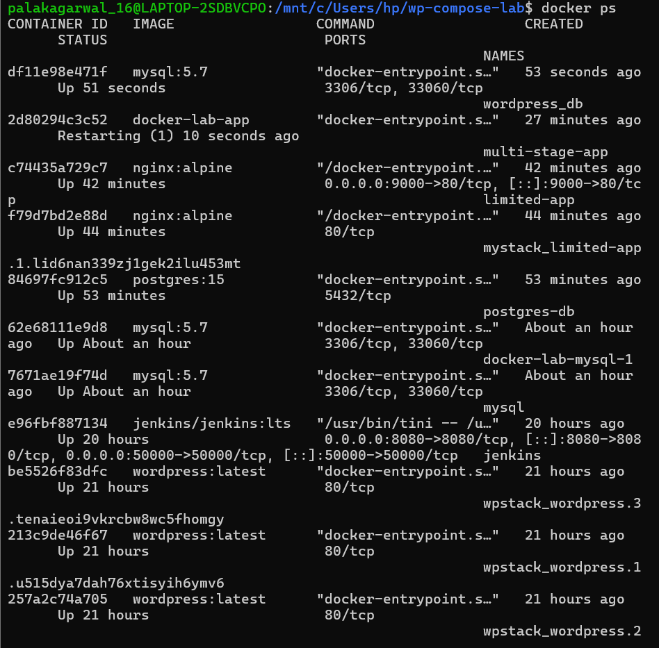

Expected:

* wordpress_app
* wordpress_db


### **Step 5: Access WordPress**

Open browser:

```
http://localhost:8080
```

### **Step 6: Check Volumes**

```bash
docker volume ls
```
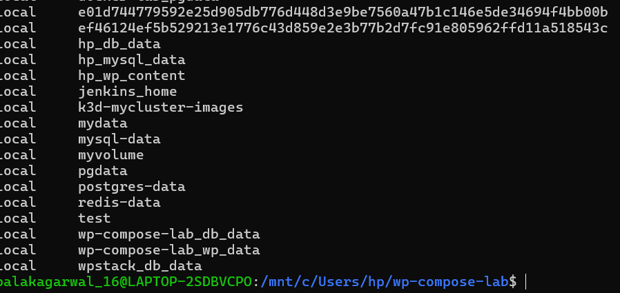

* `db_data` → database persistence
* `wp_data` → WordPress files


### **Step 7: Stop Application**

```bash
docker-compose down
```
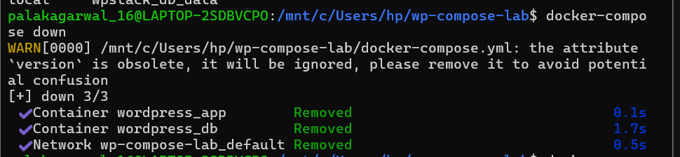

* Containers removed
* Volumes remain intact

---

## **5. Scaling in Docker Compose**


### **Method 1: Scale WordPress Containers**

```bash
docker-compose up --scale wordpress=3
```
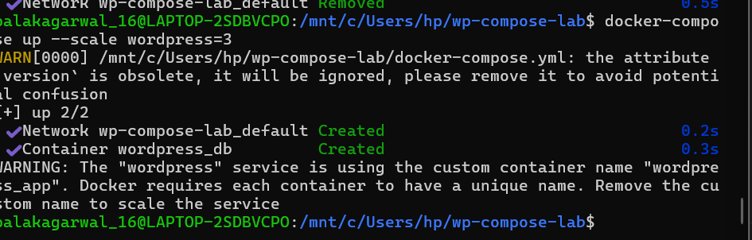
Result:

* 3 WordPress containers running

**Problem:**

* All try to use same port (8080)
* No load balancing


### **Solution: Use Reverse Proxy (Nginx)**

Add another service:

```yaml
nginx:
  image: nginx:latest
  ports:
    - "8080:80"
```

Then configure load balancing manually.


### **Limitations of Compose Scaling**

* No built-in load balancing
* No auto-healing
* Single host only
* Not production-ready for scaling

---

## **6. Running Same Setup with Docker Swarm**


### **Step 1: Initialize Swarm**

```bash
docker swarm init
```
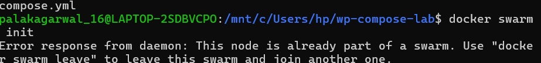


### **Step 2: Deploy Stack**

```bash
docker stack deploy -c docker-compose.yml wpstack
```
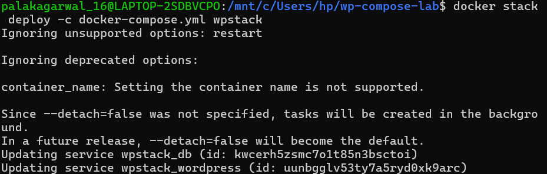


### **Step 3: Scale Service**

```bash
docker service scale wpstack_wordpress=3
```
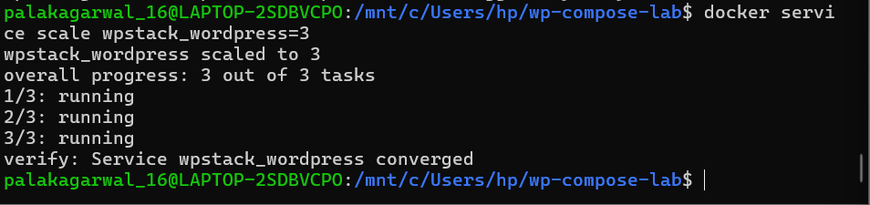


## **4. Benefits of Docker Swarm**

* Built-in load balancing
* Automatic container restart (self-healing)
* Horizontal scaling across nodes
* Rolling updates without downtime
* Service abstraction (not individual containers)


## **5. Key Learning Outcomes**

* Multi-container apps require orchestration

* Docker Compose is ideal for:

  * Development
  * Testing
  * Learning

* Docker Swarm is useful for:

  * Simple production clusters
  * Easy scaling without Kubernetes complexity

---

## **6. Conclusion**

This experiment demonstrated:

* How to deploy **WordPress + MySQL** using Docker Compose
* How containers communicate using internal networking
* Importance of **volumes for persistence**
* Scaling limitations of Compose
* Advantages of using **Docker Swarm for production-ready deployments**