## **Lab Experiment 7: CI/CD using Jenkins, GitHub and Docker Hub**

## **1. Aim**

To design and implement a complete CI/CD pipeline using **Jenkins**, integrating source code from **GitHub**, and building & pushing Docker images to **Docker Hub**.


## **5. Part A: GitHub Repository Setup (Source Code + Build Definition)**


### **5.1 Create Repository**

Create a repository on GitHub:

```id="mgl4e5"
my-app
```
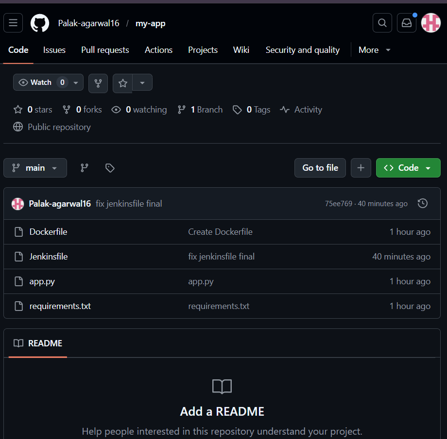

### **5.2 Project Structure**

```id="w6t8l9"
my-app/
├── app.py
├── requirements.txt
├── Dockerfile
├── Jenkinsfile
```


### **5.3 Application Code**

#### `app.py`

```python id="6nxjv6"
from flask import Flask
app = Flask(__name__)

@app.route("/")
def home():
    return "Hello from CI/CD Pipeline!"
    #return "Hello from CI/CD Pipeline!, my sapid is 123456"

app.run(host="0.0.0.0", port=80)
```
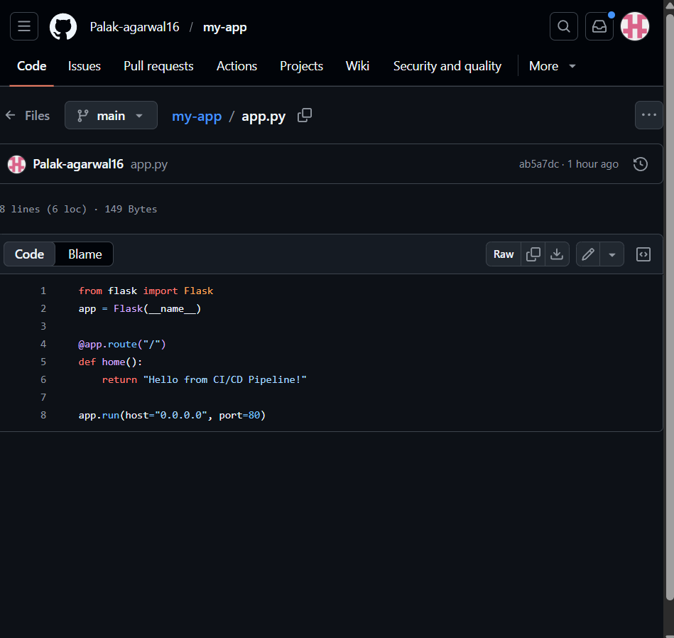

#### `requirements.txt`

```id="n6glcz"
flask
```
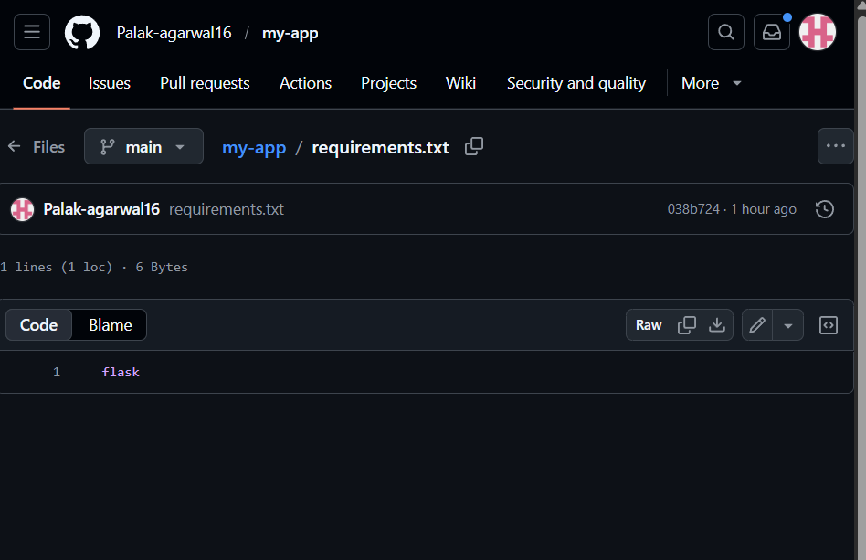


### **5.4 Dockerfile (Build Process)**

```dockerfile id="g5x5v2"
FROM python:3.10-slim

WORKDIR /app
COPY . .

RUN pip install -r requirements.txt

EXPOSE 80
CMD ["python", "app.py"]
```
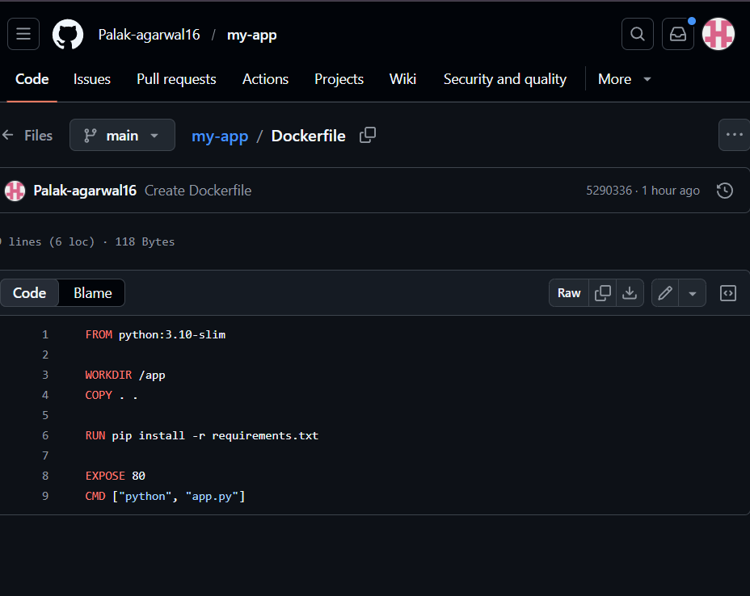


### **5.5 Jenkinsfile (Pipeline Definition in GitHub)**

```groovy id="cnbm2o"
pipeline {
    agent any

    environment {
        IMAGE_NAME = "your-dockerhub-username/myapp"
    }

    stages {

        stage('Clone Source') {
            steps {
                git 'https://github.com/your-username/my-app.git'
            }
        }

        stage('Build Docker Image') {
            steps {
                sh 'docker build -t $IMAGE_NAME:latest .'
            }
        }

        stage('Login to Docker Hub') {
            steps {
                withCredentials([string(credentialsId: 'dockerhub-token', variable: 'DOCKER_TOKEN')]) {
                    sh 'echo $DOCKER_TOKEN | docker login -u your-dockerhub-username --password-stdin'
                }
            }
        }

        stage('Push to Docker Hub') {
            steps {
                sh 'docker push $IMAGE_NAME:latest'
            }
        }
    }
}
```
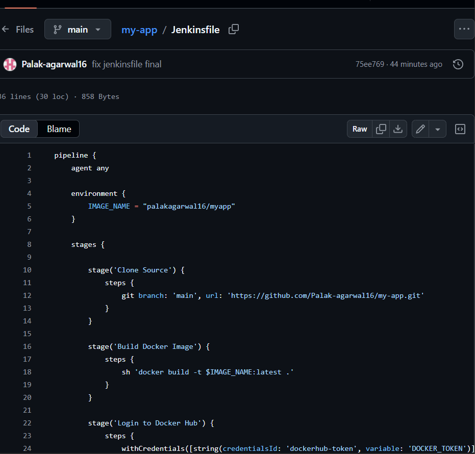


---


## **6. Part B: Jenkins Setup using Docker (Persistent Configuration)**


### **6.1 Create Docker Compose File**

```yaml id="xkpxh6"
version: '3.8'

services:
  jenkins:
    image: jenkins/jenkins:lts
    container_name: jenkins
    restart: always
    ports:
      - "8080:8080"
      - "50000:50000"
    volumes:
      - jenkins_home:/var/jenkins_home
      - /var/run/docker.sock:/var/run/docker.sock
    user: root

volumes:
  jenkins_home:
```
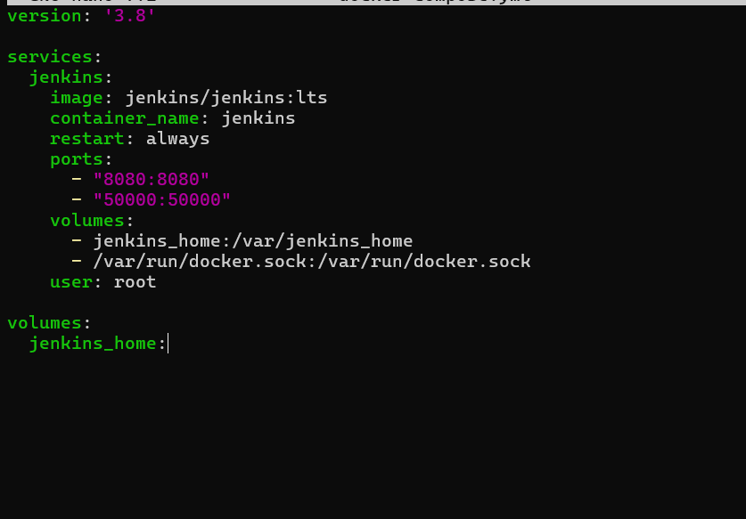


### **6.2 Start Jenkins**

```bash id="x6cim3"
docker-compose up -d
```
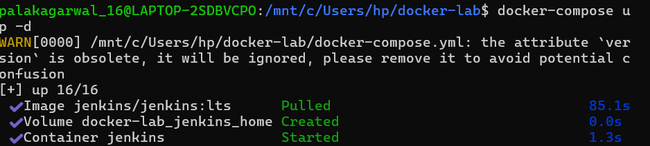

Access:


```id="d66b1p"
http://localhost:8080
```


### **6.3 Unlock Jenkins**

```bash "
docker exec -it jenkins cat /var/jenkins_home/secrets/initialAdminPassword
```
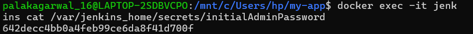


### **6.4 Initial Setup**

* Install suggested plugins
* Create admin user


---


## **7. Part C: Jenkins Configuration**


### **7.1 Add Docker Hub Credentials**

Path:

```

```

* Type: Secret Text
* ID: `dockerhub-token`
* Value: Docker Hub Access Token

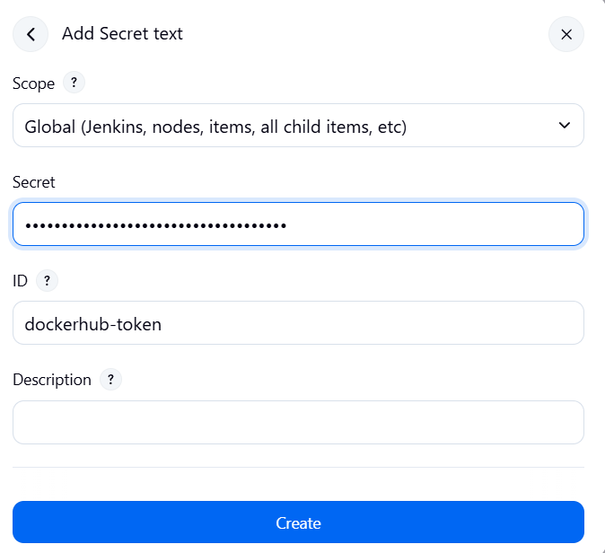

### **7.2 Create Pipeline Job**

1. New Item → Pipeline
2. Name: `ci-cd-pipeline`

Configure:

```id="36zqyf"
Pipeline script from SCM
```

* SCM: Git
* Repo URL: your GitHub repo
* Script Path: `Jenkinsfile`


---
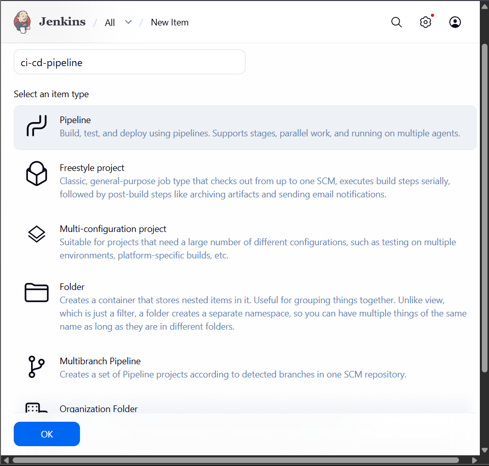


## **## 8. Part D: Trigger Mechanism (Manual Execution)
---

In this experiment, the pipeline was triggered manually from the Jenkins dashboard instead of using a GitHub webhook.

Steps followed:

1. Open Jenkins Dashboard
2. Select pipeline job (ci-cd-pipeline)
3. Click on **Build Now**
4. Jenkins starts pipeline execution

Although webhook integration enables full automation, manual triggering was used successfully for demonstrating CI/CD workflow.
---

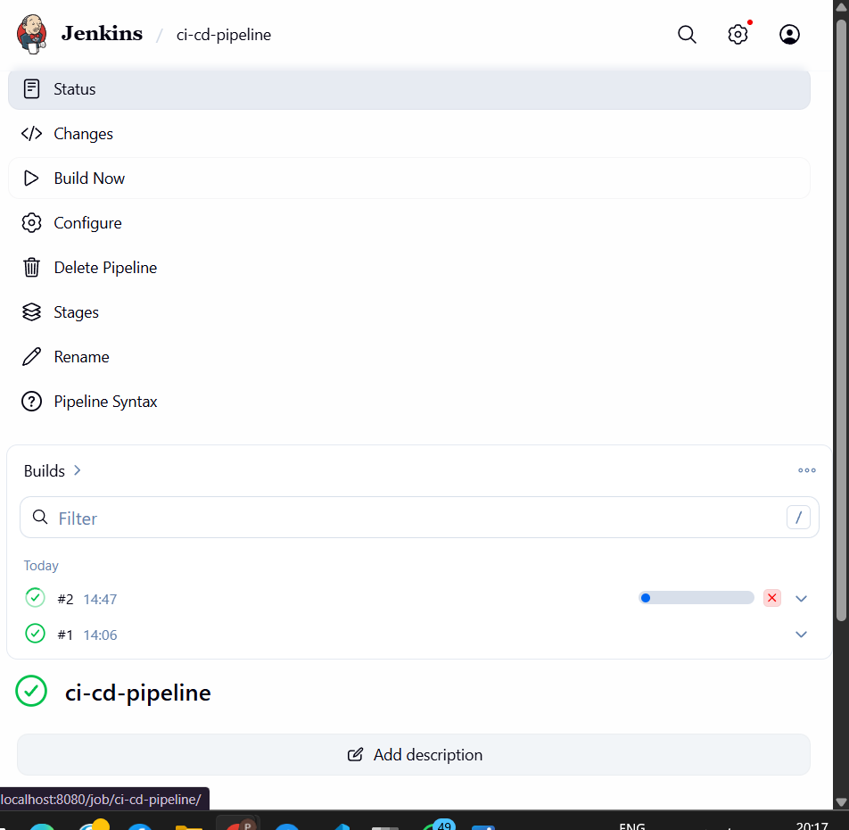


## **9. Part E: Execution Flow (Stage-wise Explanation)**


### **Stage 1: Code Push**

* Developer updates code in GitHub

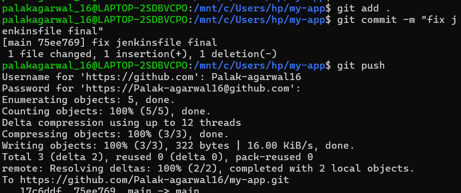

### **Stage 2:Triggering **

* GitHub sends event to Jenkins

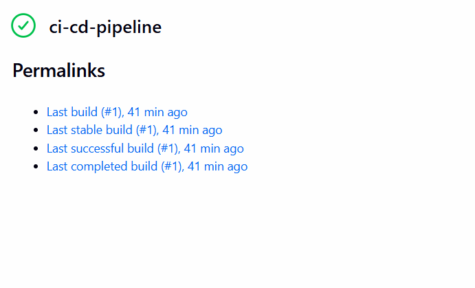


### **Stage 3: Jenkins Pipeline Execution**

#### **Stage: Clone**

* Pulls latest code from GitHub
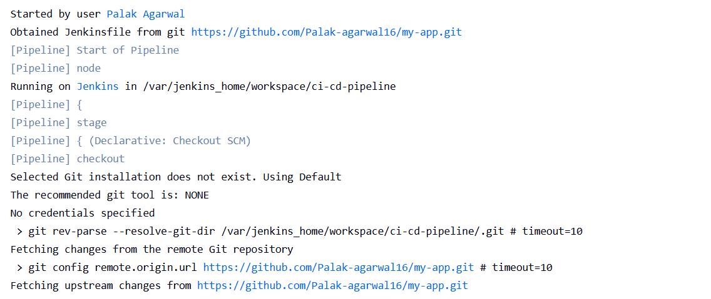


#### **Stage: Build**

* Docker builds image using Dockerfile
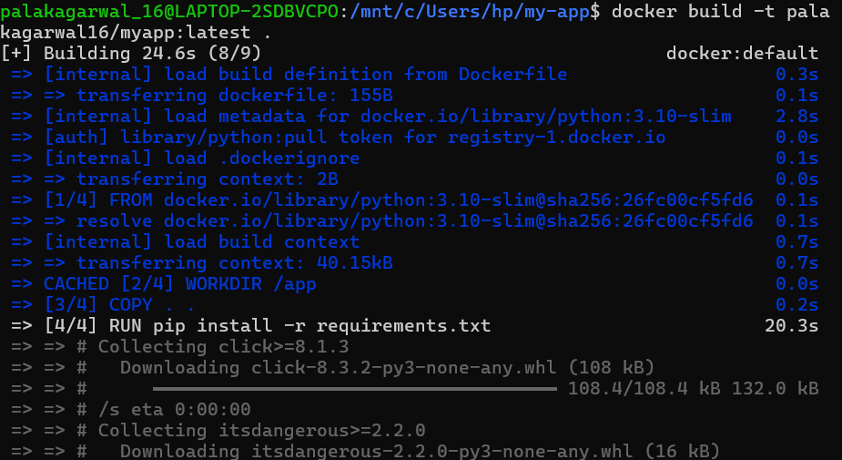


#### **Stage: Auth**

* Jenkins logs into Docker Hub using stored token
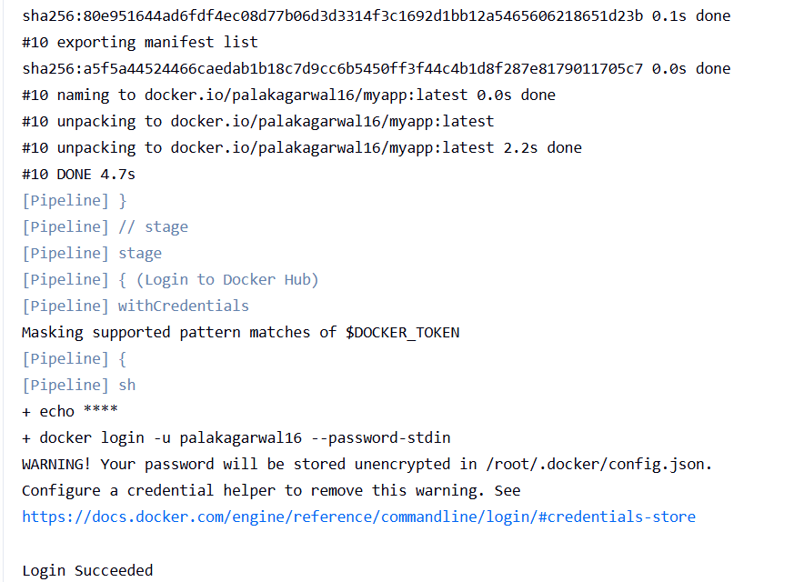


#### **Stage: Push**

* Image pushed to Docker Hub
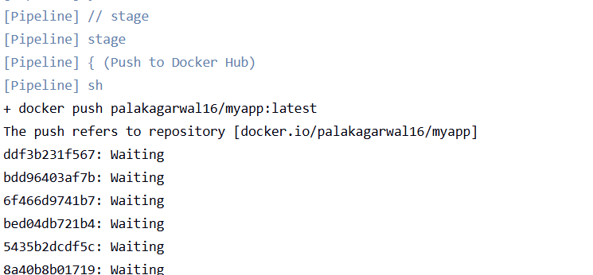


### **Stage 4: Artifact Ready**

* Docker image available globally

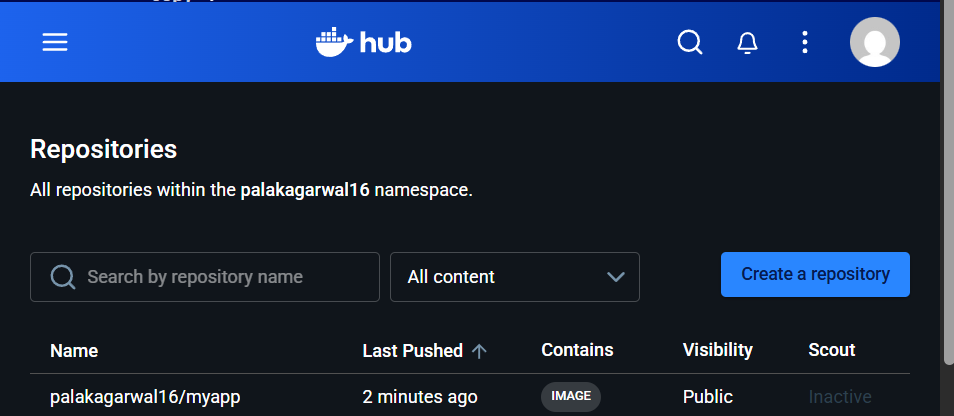


```
/var/run/docker.sock
```

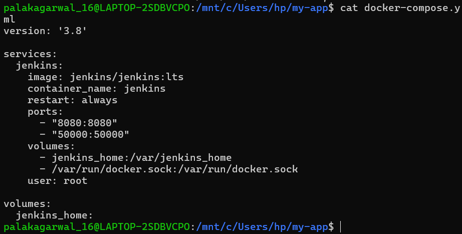

---

---

## **1. Basic Pipeline Structure**

```groovy
pipeline {
    agent any

    stages {
        stage('Build') {
            steps {
                sh 'echo Hello'
            }
        }
    }
}
```

## **Jenkins pipeline stages showing structured execution flow.
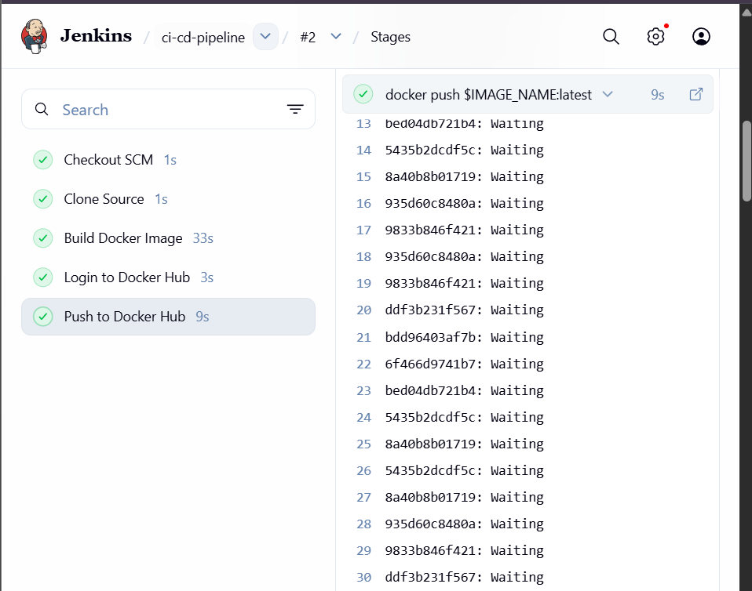

## **Jenkinsfile defining CI/CD pipeline stages using declarative syntax.
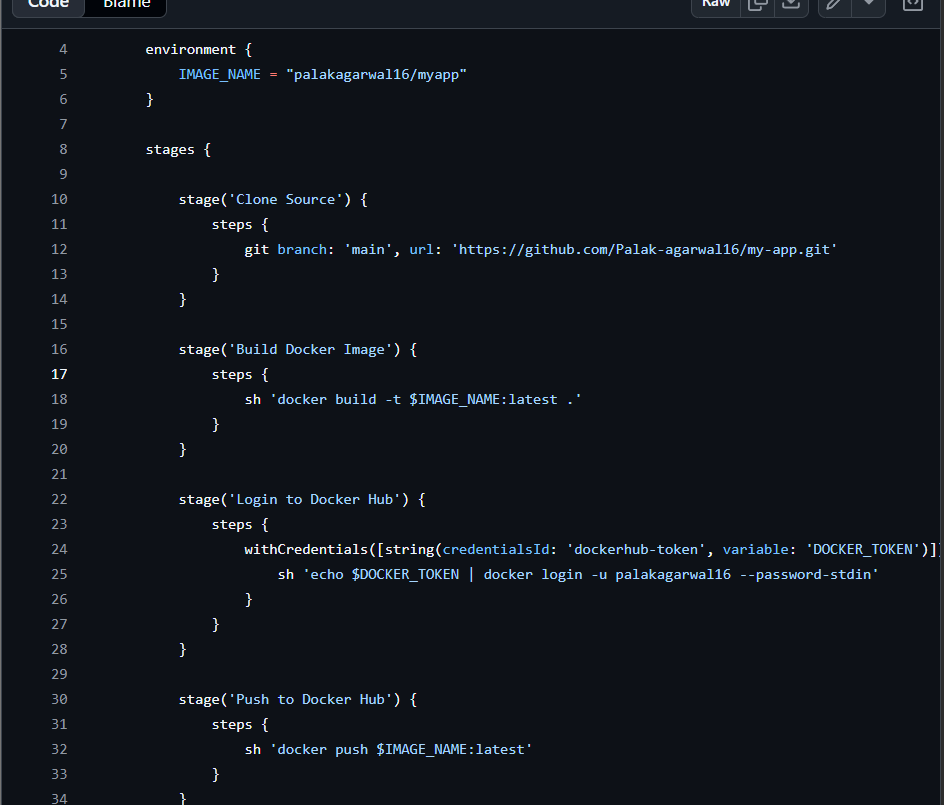

## **dockerhub-token
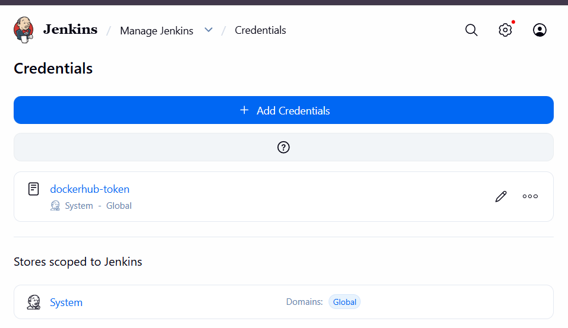

---

## **11. Key Takeaways**

* `pipeline → stages → stage → steps` = structure
* `sh` = run commands
* `git` = fetch code
* `withCredentials` = securely use secrets
* Secrets are **temporary and protected**
