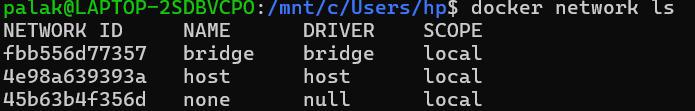
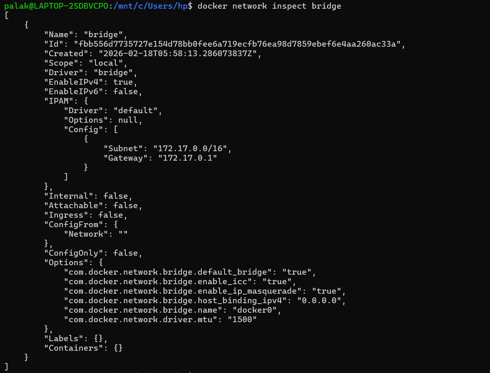
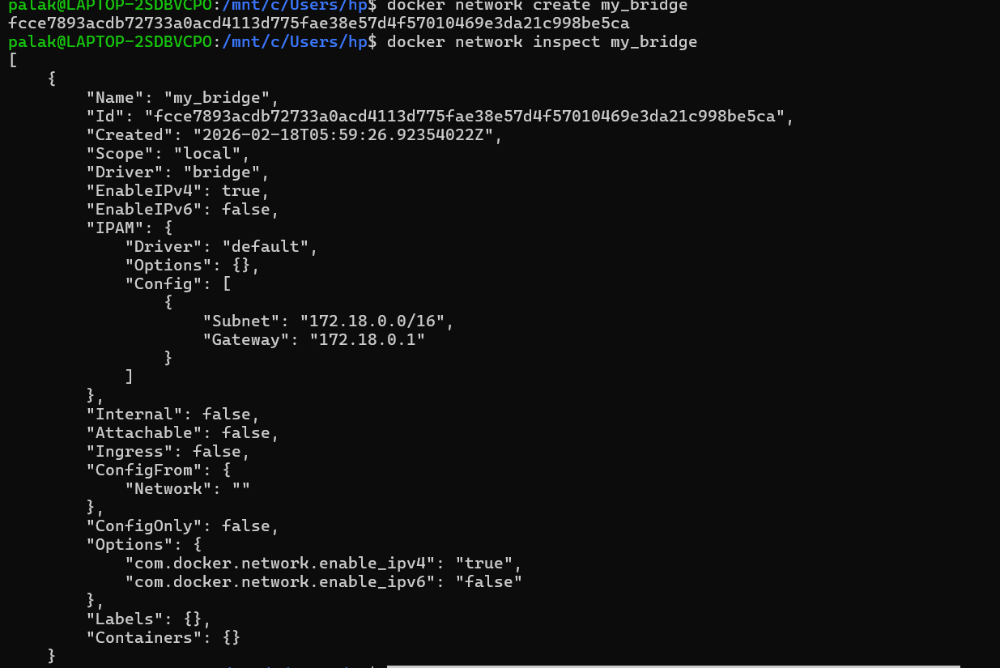
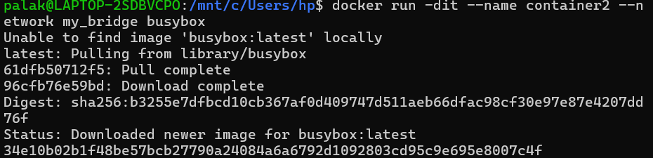
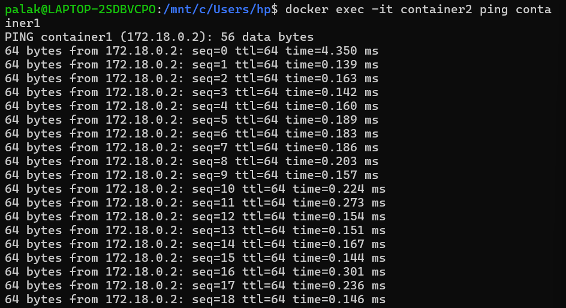
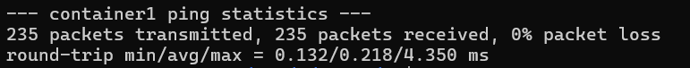
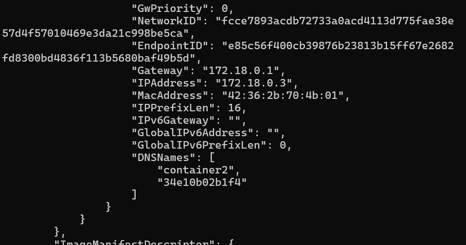
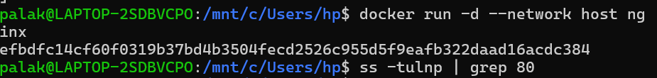

# 🐳 Docker Networking Practical (Bridge & Host Mode) – WSL

---

## 1️⃣ List Docker Networks

```bash
docker network ls
```



---

## 2️⃣ Inspect Default Bridge Network

```bash
docker network inspect bridge
```



---

## 3️⃣ Create Custom Bridge Network

```bash
docker network create my_bridge
```



---

## 4️⃣ Inspect Custom Network

```bash
docker network inspect my_bridge
```


---

## 5️⃣ Run Containers in Custom Network

### Run Nginx Container

```bash
docker run -dit --name container1 --network my_bridge nginx
```



---

### Run BusyBox Container

```bash
docker run -dit --name container2 --network my_bridge busybox
```



---

## 6️⃣ Test Container Communication (Ping)

```bash
docker exec -it container2 ping container1
```



✔️ Containers successfully communicated using container name (Docker DNS).

---

## 7️⃣ Check Container IP Details

```bash
docker inspect container2
```



✔️ Custom bridge subnet: `172.18.0.0/16`  
✔️ Gateway: `172.18.0.1`  
✔️ container1 IP: `172.18.0.2`  
✔️ container2 IP: `172.18.0.3`

---

## 8️⃣ Run Container in Host Network Mode

```bash
docker run -d --network host nginx
```



---

## 9️⃣ Verify Port 80 is Listening

```bash
ss -tulnp | grep 80
```

✔️ Nginx is directly using host network stack.

---

# 📌 Conclusion

- Default bridge network uses docker0
- Custom bridge network provides automatic DNS resolution
- Containers in same custom network can communicate using container names
- Host network mode shares host networking (no isolation)

