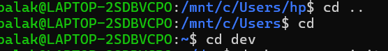
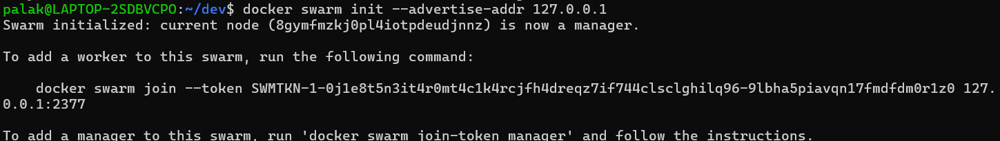
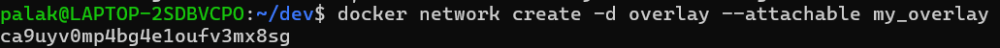
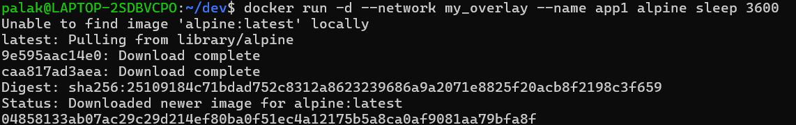
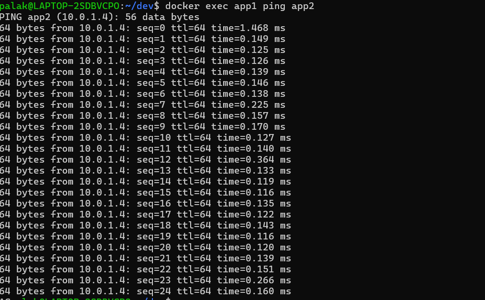

# 🐳 Docker Swarm & Overlay Network Communication

---

## 🛠️ Step 1: Navigate to Working Directory

```bash
cd dev
```



---

## 🛠️ Step 2: Initialize Docker Swarm

```bash
docker swarm init --advertise-addr 127.0.0.1
```




✔ Swarm initialized successfully  
✔ Current node is now a Manager  

---

## 🛠️ Step 3: Create Overlay Network

```bash
docker network create -d overlay --attachable my_overlay
```




✔ Overlay network `my_overlay` created  

---

## 🛠️ Step 4: Run First Container (app1)

```bash
docker run -d --network my_overlay --name app1 alpine sleep 3600
```



✔ Alpine image pulled  
✔ Container `app1` started  

---

## 🛠️ Step 5: Run Second Container (app2)

```bash
docker run -d --network my_overlay --name app2 alpine sleep 3600
```


✔ Container `app2` started successfully  

---

## 🛠️ Step 6: Verify Communication Between Containers

```bash
docker exec app1 ping app2
```



✔ app1 successfully pings app2  
✔ Containers communicate using container names  
✔ Overlay network working correctly  

---

