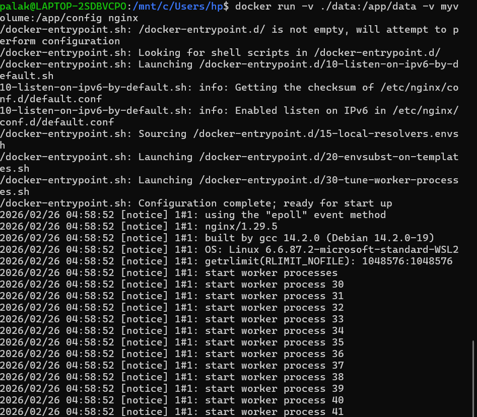
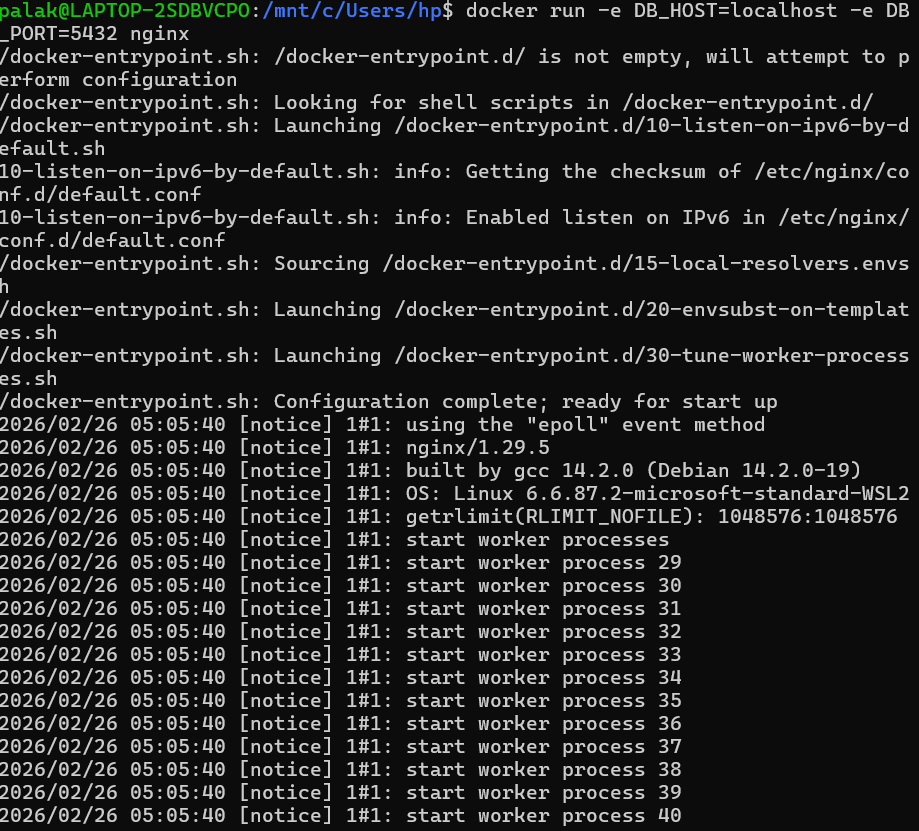
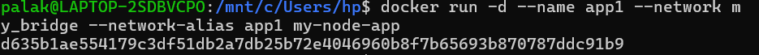
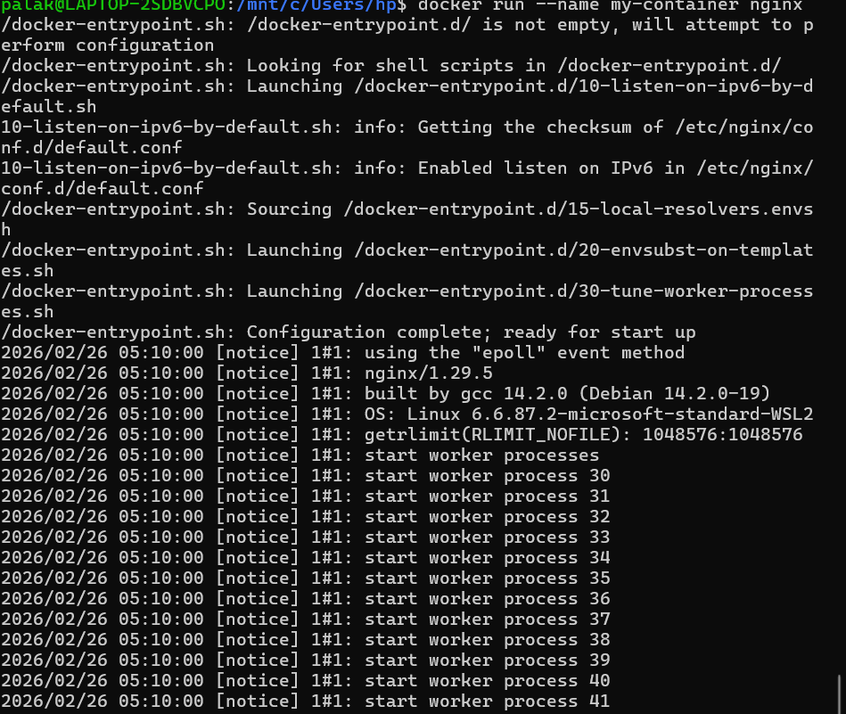
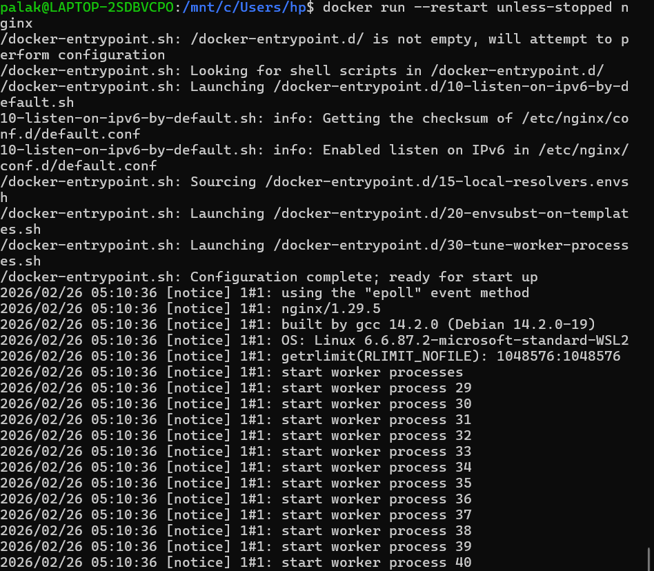
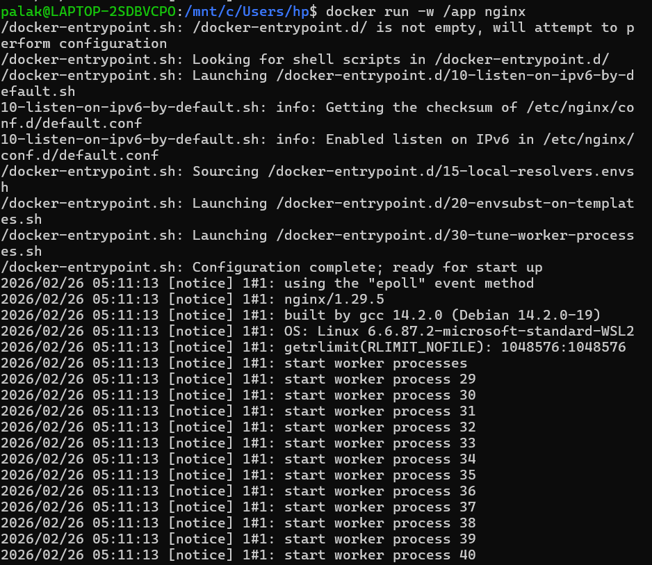
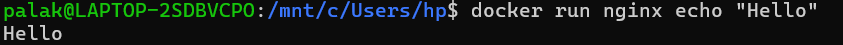
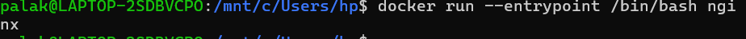
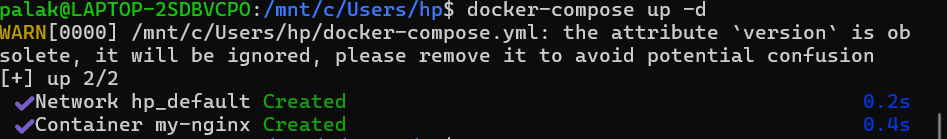
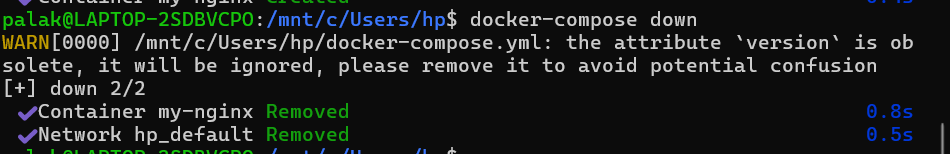

🐳 Docker NGINX & Container Management Guide

---

# 🛠️ Step 1: Run NGINX with Port Mapping

```bash
docker run -p 8080:80 -p 3000:3000 nginx
```


# Step 2: Run NGINX with Volume Mapping

```bash
docker run -v ./data:/app/data -v 
myvolume:/app/config nginx
```


✔ Local directory ./data mounted to /app/data

✔ Named volume myvolume created for persistence

✔ Data survives even if the container is deleted

# Step 3: Run with Environment Variables
```bash
docker run -e DB_HOST=localhost -e DB_PORT=5432 nginx
```


✔ DB_HOST and DB_PORT injected into container

✔ Useful for dynamic application configuration

# Step 4: Run in Detached Mode with Network
```bash
docker run -d --name app1 --network my_bridge --network-alias app1 my-node-app
```


✔ -d → Running in background (Detached)

✔ Connected to my_bridge network

✔ Container alias app1 enabled for discovery

# Step 5: Run with Custom Container Name

```bash
docker run --name my-container nginx
```


✔ Assigned specific name my-container

✔ Replaces random Docker-generated names

# Step 6: Run with Restart Policy
```bash
docker run --restart unless-stopped nginx
```


✔ Container will auto-restart on crash or reboot

✔ Will only stay stopped if manually halted

# Step 7: Set Working Directory
```bash
docker run -w /app nginx
```


✔ Default path set to /app inside container

✔ All subsequent commands execute from this path

# Step 8: Override Default Command
```bash
docker run nginx echo "Hello"
```


✔ NGINX default start command bypassed

✔ Successfully executed custom echo command

# Step 9: Override Entrypoint

```bash
docker run --entrypoint /bin/bash nginx
```


✔ Default entrypoint script replaced

✔ Container opened in Bash shell for debugging

# Step 10: Run using Docker Compose

```bash
docker-compose up -d
```


✔ hp_default network created automatically

✔ my-nginx service started in detached mode

✔ Configuration managed via docker-compose.yml

# Step 11: Stop and Remove Services
```bash
docker-compose down
```


✔ my-nginx container stopped and removed

✔ hp_default network removed

✔ Cleanly winds down the environment

<h4 align='center'> Conclusion </h4>

<hr>

Throughout this practical guide, we have explored the versatility of Docker for managing NGINX containers. By mastering Port Mapping, we enabled external access; via Volumes, we ensured data persistence; and through Networking, we established secure container-to-container communication.

---