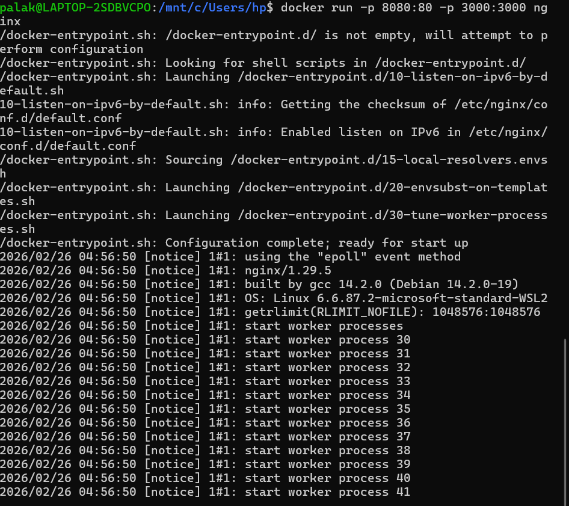

<h2 align='center'> Docker-Compose vs Docker-Run </h2>


<hr>

<h4 align='center'> Introduction </h4>

<hr>

**Docker Compose** is essentially a YAML-based wrapper around multiple `docker run` commands. It translates your compose file into individual Docker commands behind the scenes. Let's see how each `docker run` flag maps to Docker Compose.


<hr>

<h4 align='center'> HandsOn </h4>

<hr>


**Step-1:- Running Nginx with Docker Run**
```bash
docker run \
  --name my-nginx \
  -p 8080:80 \
  -v ./html:/usr/share/nginx/html \
  -e NGINX_HOST=localhost \
  --restart unless-stopped \
  -d \
  nginx:alpine
```



**Step-2:- Same Setup with Docker Compose:**

**`docker-compose.yml`**
```yaml
version: '3.8'
services:
  nginx:
    image: nginx:alpine          # Image name (same as in docker run)
    container_name: my-nginx     # --name my-nginx
    ports:
      - "8080:80"               # -p 8080:80
    volumes:
      - ./html:/usr/share/nginx/html  # -v ./html:/usr/share/nginx/html
    environment:
      - NGINX_HOST=localhost    # -e NGINX_HOST=localhost
    restart: unless-stopped     # --restart unless-stopped
```

**Note:** \
-d flag in docker run = detached mode \
In docker-compose, use: docker-compose up -d
