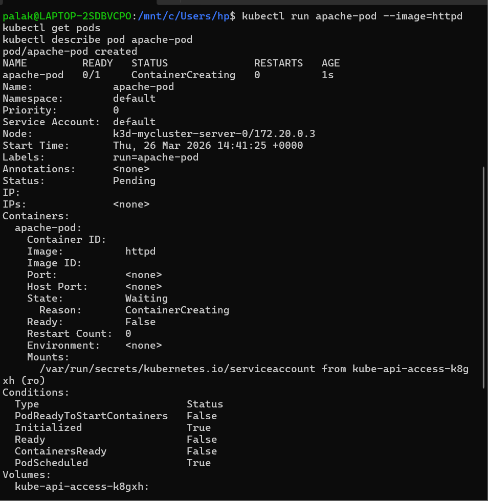
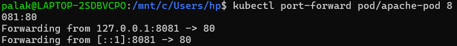
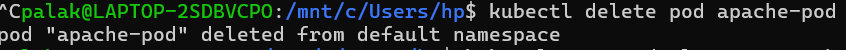
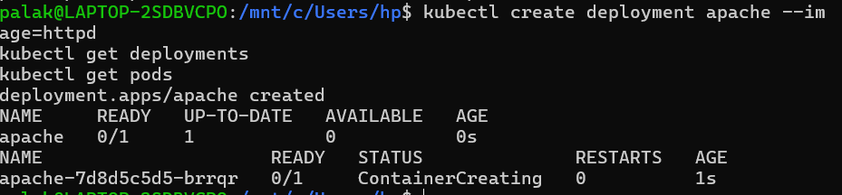
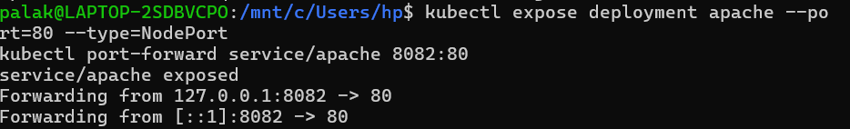
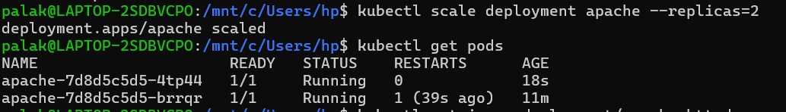
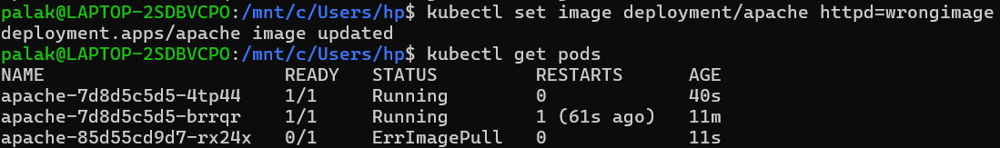
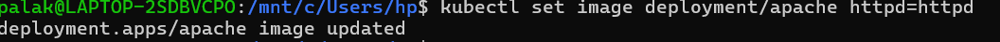
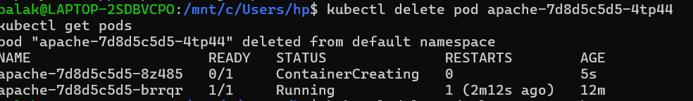
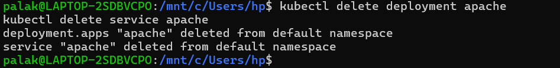

<h2 align='center'> Kubernetes Apache Web App </h2>


<hr>

<h4 align='center'> HandsOn  </h4>

<hr>

**Step-1: Run Pod**

```bash
kubectl run apache-pod --image=httpd
kubectl get pods
kubectl describe pod apache-pod
```



*Explanation:-*

* `kubectl` → Kubernetes CLI
* `run` → Create pod
* `--image=httpd` → Apache image

---


**Step-2: Access Application**

```bash
kubectl port-forward pod/apache-pod 8081:80
```

Open:

```
http://localhost:8081
```



---

**Step-3: Delete Pod**

```bash
kubectl delete pod apache-pod
```



*Explanation:-*

* Pod deleted permanently
* No self-healing

---

**Step-4: Create Deployment**

```bash
kubectl create deployment apache --image=httpd
kubectl get deployments
kubectl get pods
```



---


**Step-5: Expose Deployment**

```bash
kubectl expose deployment apache --port=80 --type=NodePort
kubectl port-forward service/apache 8082:80
```



---


**Step-6: Scale Deployment**

```bash
kubectl scale deployment apache --replicas=2
```



*Explanation:-*

* `scale` → Change replica count
* `--replicas=2` → Run 2 pods

---

**Step-7: Debugging Scenario**

```bash
kubectl set image deployment/apache httpd=wrongimage
```



*Explanation:-*

* Causes ImagePullBackOff error

---

**Step-8: Fix Application**

```bash
kubectl set image deployment/apache httpd=httpd
```



---

**Step-9: Exec into Pod**

```bash
kubectl exec -it <pod-name> -- /bin/bash
```

```bash
ls /usr/local/apache2/htdocs
```



---

**Step-10: Self-Healing**

```bash
kubectl delete pod <pod-name>
```

```bash
kubectl get pods
```



---

<hr>

<h4 align='center'> Key Takeaways  </h4>

<hr>

#### Summary of Core Commands

| Action            | Command                              |
| ----------------- | ------------------------------------ |
| Run pod           | kubectl run apache-pod --image=httpd |
| Get pods          | kubectl get pods                     |
| Describe pod      | kubectl describe pod apache-pod      |
| Delete pod        | kubectl delete pod apache-pod        |
| Create deployment | kubectl create deployment apache     |
| Expose service    | kubectl expose deployment apache     |
| Scale deployment  | kubectl scale deployment apache      |
| Update image      | kubectl set image deployment/apache  |
| Exec into pod     | kubectl exec -it <pod> -- /bin/bash  |

---

#### Real Industry Use Case Example

E-commerce Website:

| Layer        | Kubernetes Usage |
| ------------ | ---------------- |
| Frontend     | 3 replicas       |
| Backend API  | 4 replicas       |
| Database     | Stateful set     |
| Load balance | Service          |
| Auto-healing | Deployment       |

---

#### Pod vs Deployment

| Feature          | Pod        | Deployment        |
| ---------------- | ---------- | ----------------- |
| Scope            | Single pod | Managed workload  |
| Scaling          | No         | Yes               |
| Self-healing     | No         | Yes               |
| Load balancing   | No         | Yes (via service) |
| Production-ready | No         | Yes               |

---

#### Kubernetes Architecture

User → API Server → Scheduler → Nodes → Pods

Cluster-based system.

---

#### Final Summary

| Capability           | Pod | Deployment |
| -------------------- | --- | ---------- |
| Runs container       | Yes | Yes        |
| Multi-node           | No  | Yes        |
| Scaling              | No  | Yes        |
| Auto-healing         | No  | Yes        |
| Load balancing       | No  | Yes        |
| Production readiness | No  | Yes        |

---
