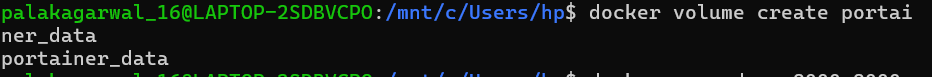
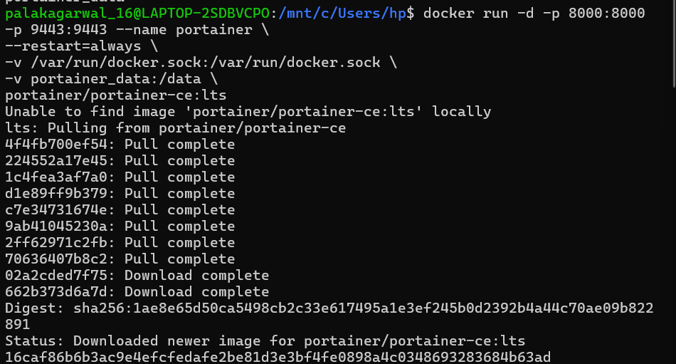
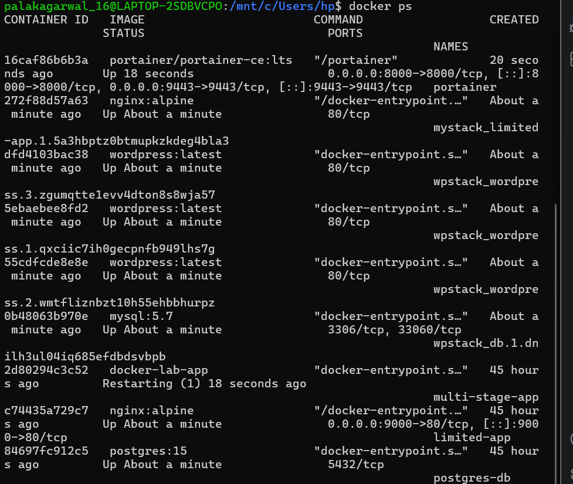
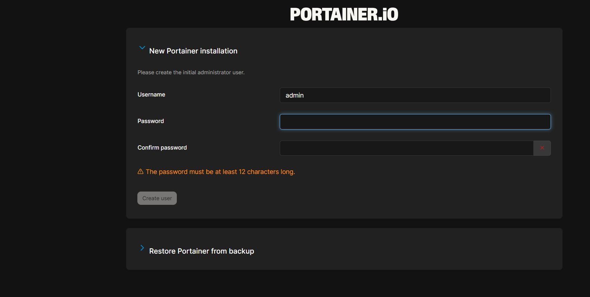
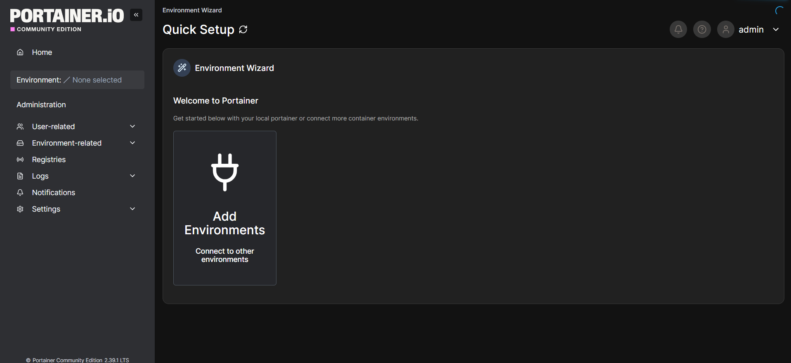
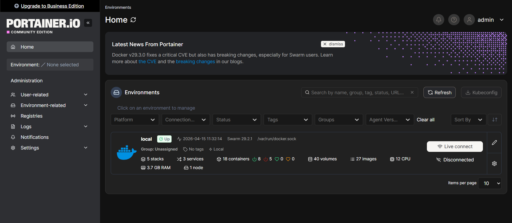

# 🐳 Docker GUI Management with Portainer (Hands-on)

---

## 📌 Aim
To install and use **Portainer**, a lightweight web-based GUI tool to manage Docker containers, images, volumes, and networks.

---

## 🛠️ Prerequisites
- Docker Desktop installed and running
- WSL2 enabled (for Windows users)
- Internet connection

---
6. Restart terminal

---

## 🚀 Step-by-Step Installation

### 🔹 Step 1: Create Volume
```bash
docker volume create portainer_data
```



---

### 🔹 Step 2: Run Portainer Container
```bash
docker run -d -p 8000:8000 -p 9443:9443 --name portainer
--restart=always
-v /var/run/docker.sock:/var/run/docker.sock
-v portainer_data:/data
portainer/portainer-ce:lts
```


### 🔹 Step 3: Verify Container
```bash
docker ps
```


---
### 🔹 Step 4: Access Web UI
Open browser and go to:

https://localhost:9443

### 🔹 Step 6: Create Admin User
- Enter username  
- Set password  
- Click Create User  


---

### 🔹 Step 7: Connect Environment
- Select Docker → Local  
- Click Connect  



---

### 🔹 Step 8: Portainer Dashboard

📸 Screenshot: Dashboard View  
(Add screenshot of dashboard)

---

## 📊 Features of Portainer
- Manage Containers (Start/Stop/Delete)
- Manage Images
- Manage Volumes
- Manage Networks
- User-friendly GUI

---

### Port already in use

docker run -d -p 9444:9443 ...