# Git Basics: Initialization, Commits, Branching, and Merging

## Objective
Learn the fundamental operations of Git version control, focusing on repository initialization, staging, committing, branching, and merging.

---

## Task 1: Initialize a Git Repository and Initial Commits

**Commands Executed:**
```bash
git init
git status
```
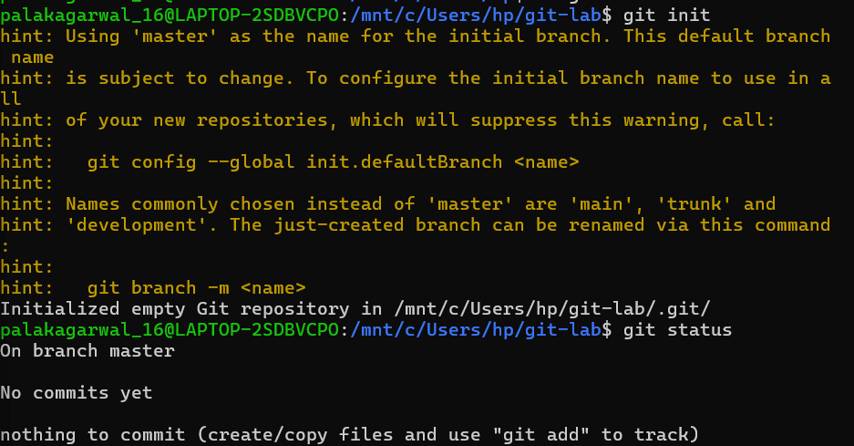

*We began by creating a set of files and adding them to the Git repository.*
```bash
echo "..." > test
git add test
git commit -m "test"
```
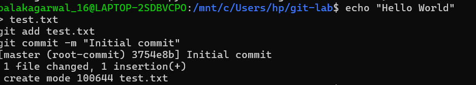
---

## Task 2: Adding and Committing Multiple Files

**Commands Executed:**
```bash
git add test2.txt
git commit -m "test2"
git add test3.txt
git commit -m "test3"
```

**Observation:**
We added consecutive commits to track the project's history incrementally.


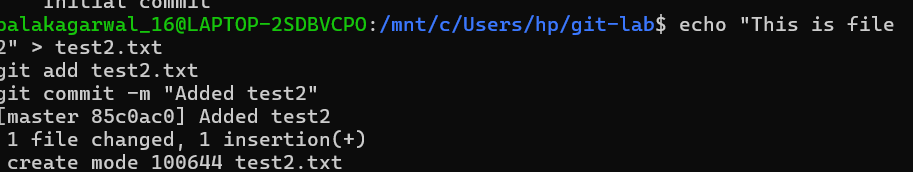


---

## Task 3: Modifying Files and Checking Diffs

**Commands Executed:**
```bash
git diff
git status
git commit -am "test3 modified"
```
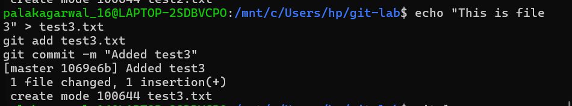

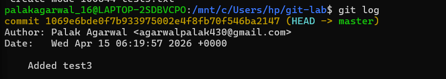
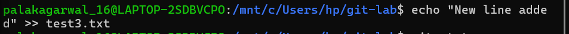
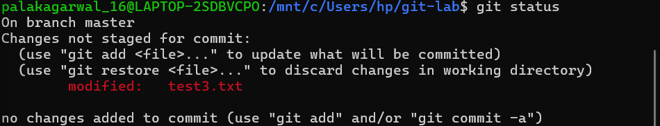
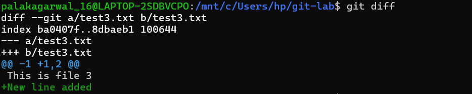

**Observation:**
Changes made to previously tracked files were reviewed using `git diff` and then committed directly.


---

## Task 4: Working With Branches

Branching allows for isolated development without affecting the `main` branch.

**Commands Executed:**
```bash
git branch feature
git switch feature

# Or: git checkout -b feature
```
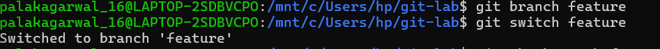

**Observation:**
A new branch `feature` was created and checked out. A new characteristic `feature.txt` was added to this branch.

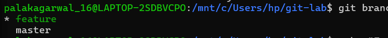

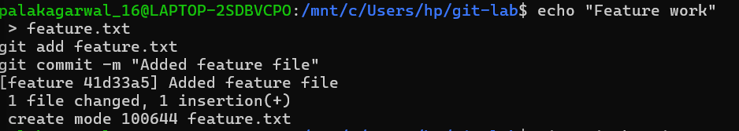

---

## Task 5: Merging Branches

After completing the experimental changes, the branch is merged back to main.

**Commands Executed:**
```bash
git switch main
git merge feature
git log --oneline --graph --all
```

**Observation:**
The commits from the `feature` branch were integrated into `main`. The `git log` now displays a merged history.

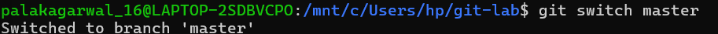

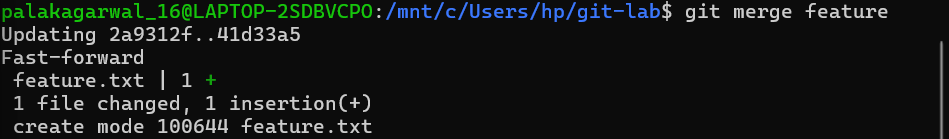
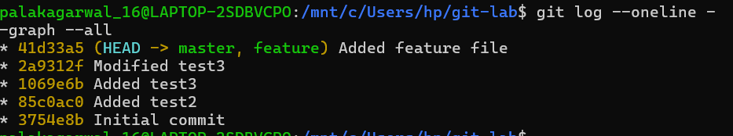

---

## Key Insights Gained

- **Tracking**: `git init` and `git status` help you inspect your working directory's state.
- **Committing**: `git add` and `git commit` store states incrementally so you can track all changes over time.
- **Diffing**: `git diff` clearly outlines what was modified within tracked files before staging.
- **Branching**: `git branch` and `git switch` provide isolated environments to experiment without breaking the production (`main`) code.
- **Merging**: `git merge` safely combine separate histories, effectively updating the main project with new functionality.