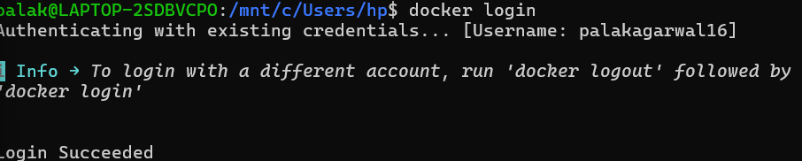
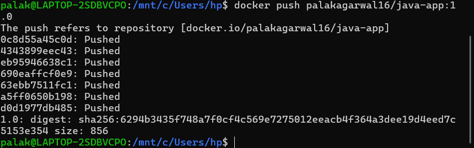
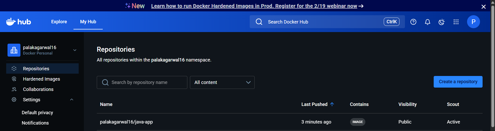

# Uploding Image on Docker Hub

## Login/SignUp on docker hub website

Login and get your username


Inside WSL:

---

```bash
docker login
```



---

## Push image to docker hub

Check for images available:

```bash
docker images
```



Add label:

```bash
docker tag java-app rajrishu14
01/java-app
```

Push the image

```bash
docker tag java-app rajrishu14
01/java-app
```


## Result

image add to our repository:



