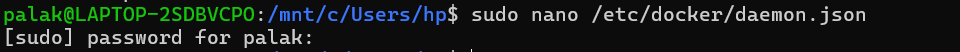
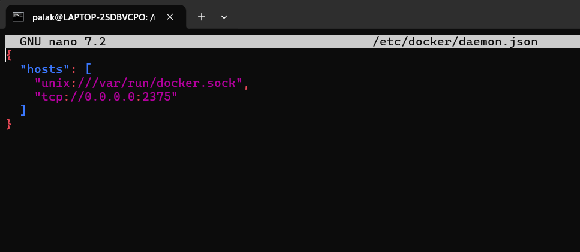
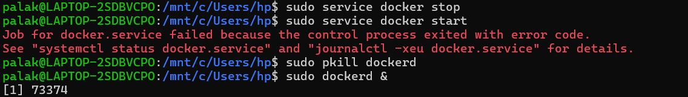
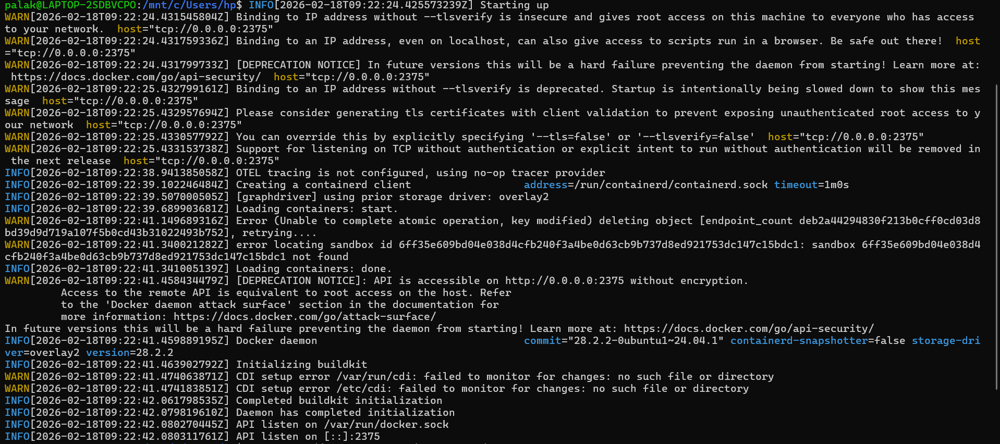
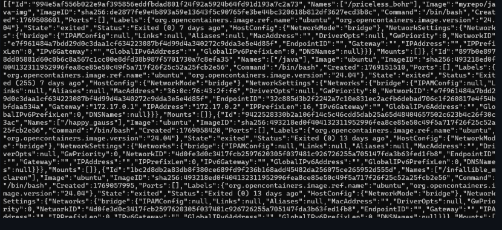

## Expose Docker API on Linux / WSL (docker.io)

### Step 1: Edit Docker daemon config

```bash
sudo nano /etc/docker/daemon.json
```


Add:

```json
{
  "hosts": [
    "unix:///var/run/docker.sock",
    "tcp://0.0.0.0:2375"
  ]
}
```




### Step 2: Restart Docker

```bash
sudo service docker stop
sudo service docker start
sudo pkill dockerd
sudo dockerd &
```



### Step 3: Verify port is open

```bash
ss -lntp | grep 2375
```


---

## 6. Test Docker API over TCP

From same machine:

```bash
curl http://localhost:2375/version
```

From another machine:

```bash
curl http://<host-ip>:2375/containers/json
```

